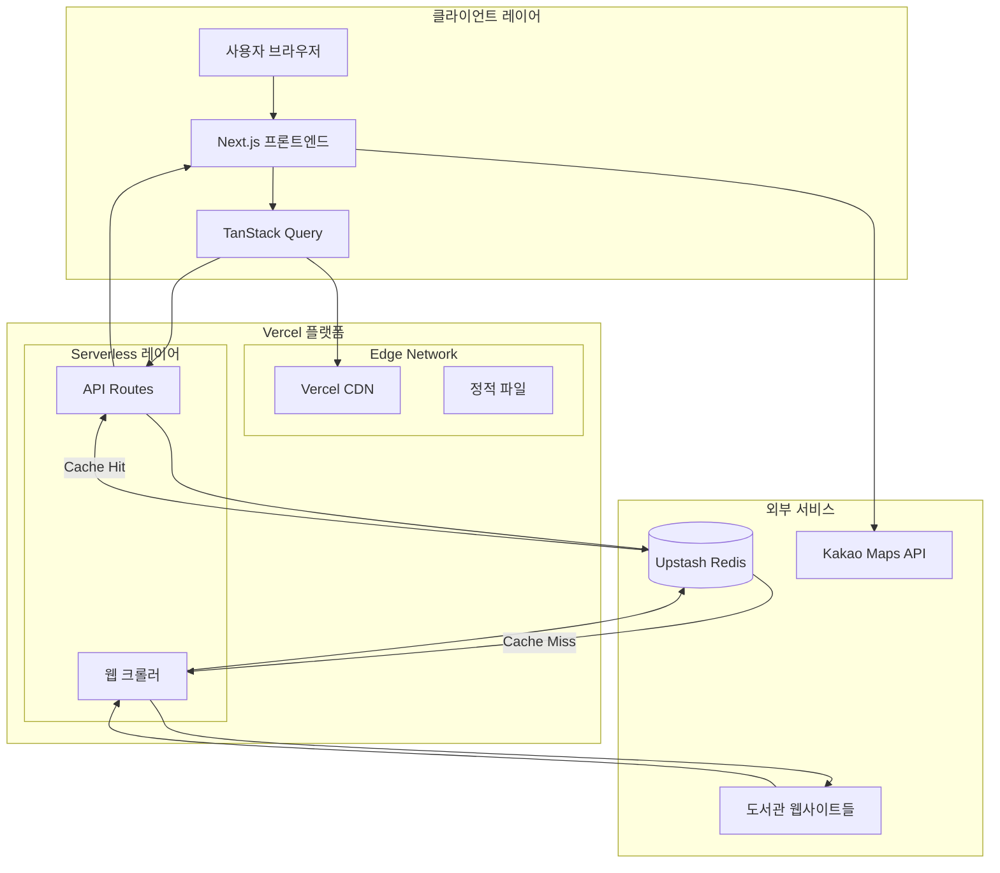
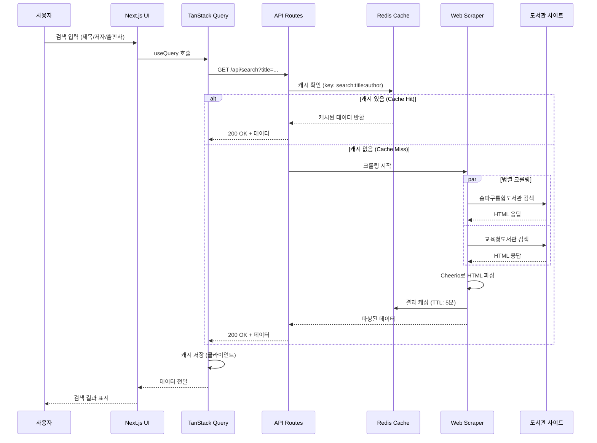
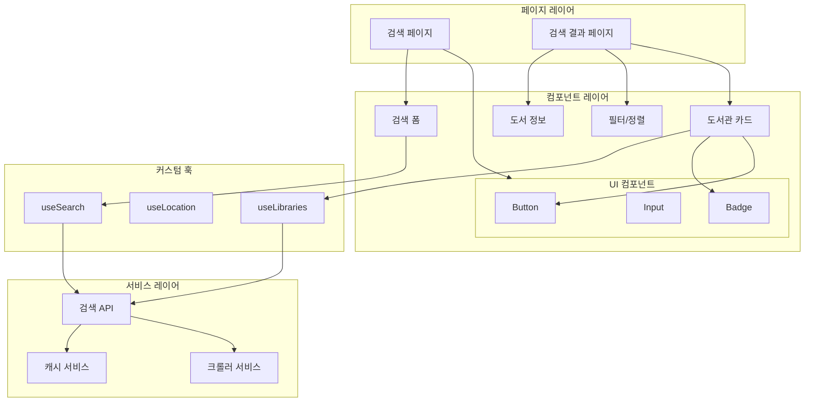

# 책크 서비스 Code Architecture

> 송파구 도서관 통합 검색 서비스 "책크"의 기술 아키텍처 설계 문서

**버전**: 1.0  
**최종 수정일**: 2026-01-22  
**배포 환경**: Vercel

---

## 목차

1. [프로젝트 개요](#프로젝트-개요)
2. [기술 스택 상세](#기술-스택-상세)
3. [시스템 아키텍처](#시스템-아키텍처)
4. [프로젝트 구조](#프로젝트-구조)
5. [데이터 흐름](#데이터-흐름)
6. [웹 크롤링 전략](#웹-크롤링-전략)
7. [API 설계](#api-설계)
8. [스타일링 전략](#스타일링-전략)
9. [상태 관리](#상태-관리)
10. [성능 최적화](#성능-최적화)
11. [보안](#보안)
12. [배포 전략](#배포-전략)
13. [개발 환경 설정](#개발-환경-설정)
14. [향후 확장 계획](#향후-확장-계획)
15. [참고 자료](#참고-자료)

---

## 프로젝트 개요

### 서비스 소개

**책크**는 송파구 내 24개 도서관(공공도서관 14개, 스마트도서관 9개, 교육청도서관 1개)의 도서 소장 및 대출 가능 여부를 한 번에 검색하는 통합 검색 서비스입니다.

### 핵심 기능 (MVP)

- **통합 도서 검색**: 제목, 저자, 출판사 기반 복합 검색
- **실시간 대출 현황**: 각 도서관의 실시간 소장 및 대출 가능 여부 확인
- **위치 기반 정렬**: 사용자 위치에서 가까운 도서관 순으로 자동 정렬
- **도서관 상세 정보**: 운영 시간, 연락처, 주소, 예약 링크 제공
- **반응형 디자인**: 모바일, 태블릿, 데스크톱 대응
- **접근성**: 모든 연령대가 쉽게 사용 가능한 UI

### MVP 개발 단계

본 프로젝트는 5단계(Phase)로 나누어 개발합니다:

```
Phase 1: 환경 구축 및 기초 설정 (1-2주)
   → 개발 환경, 디자인 시스템, TypeScript 타입

Phase 2: 백엔드 인프라 및 크롤링 (2-3주)
   → Redis, 웹 크롤러, API Routes

Phase 3: 프론트엔드 구현 (2-3주)
   → React 컴포넌트, 페이지, 위치 기능

Phase 4: 최적화 및 배포 준비 (1-2주)
   → 성능, 접근성, 보안, Vercel 설정

Phase 5: 테스트 및 배포 (1주)
   → QA, 프로덕션 배포, 모니터링
```

**총 예상 기간**: 7-11주 (약 2-3개월)

### MVP 이후 확장 계획

- **Phase 2+ (알림)**: 대출 가능 알림, 신간 알림
- **Phase 3+ (지도)**: 카카오맵 통합, 길찾기 연동
- **Phase 4+ (사용자)**: 회원 시스템, 독서 이력 관리
- **Phase 5+ (지역확대)**: 서울시 전역, 전국 확대
- **Phase 6+ (커뮤니티)**: 리뷰, 독서 모임

### 기술 선정 철학

1. **Vercel 최적화**: Vercel Serverless 환경에 최적화된 기술 스택
2. **최신 안정화 버전**: 2026년 1월 기준 최신 안정화 버전 사용
3. **개발자 경험**: TypeScript, 최신 React 패러다임으로 생산성 향상
4. **성능 우선**: 서버 컴포넌트, 캐싱, 코드 스플리팅으로 빠른 로딩 속도
5. **확장성**: 향후 기능 추가를 고려한 모듈화 구조

---

## 기술 스택 상세

### 핵심 프레임워크

#### Next.js 15.5.9
- **버전**: 15.5.9 (2025년 12월 11일 릴리스)
- **라이선스**: MIT
- **공식 문서**: https://nextjs.org/docs

**선택 이유**:
- React 19 완벽 지원
- Vercel 배포에 최적화 (Zero-config)
- Turbopack Dev로 빠른 개발 환경
- App Router로 서버 컴포넌트 활용
- API Routes로 백엔드 로직 통합

**주요 기능**:
- **Turbopack Dev**: 기존 Webpack 대비 최대 700배 빠른 HMR
- **Server Components**: 서버에서 렌더링하여 클라이언트 번들 크기 감소
- **Streaming SSR**: 페이지를 청크 단위로 스트리밍하여 TTFB 개선
- **Image Optimization**: `next/image`로 자동 최적화 및 WebP 변환

#### React 19.2.2
- **버전**: 19.2.2 (2025년 12월 11일 릴리스)
- **라이선스**: MIT
- **공식 문서**: https://react.dev

**선택 이유**:
- Actions API로 폼 처리 간소화
- `use` hook으로 비동기 데이터 처리 개선
- Web Components 지원
- Hydration 오류 개선

**주요 신기능**:
- **Actions**: 선언적 폼 제출 및 비동기 상태 관리
- **use hook**: Promise/Context를 Suspense와 함께 사용
- **ref as prop**: forwardRef 없이 ref 전달 가능
- **Improved Hydration**: 확장 프로그램이 삽입한 DOM 자동 스킵

#### TypeScript 5.7.2
- **버전**: 5.7.2 (2024년 11월 22일 릴리스)
- **라이선스**: Apache-2.0
- **공식 문서**: https://www.typescriptlang.org

**선택 이유**:
- 강력한 타입 체킹으로 런타임 에러 사전 방지
- IDE 자동완성으로 개발 생산성 향상
- ES2024 지원

**주요 기능**:
- **ES2024 Target**: `Object.groupBy`, `Promise.withResolvers` 등 최신 기능
- **Never-initialized 변수 검사**: 초기화되지 않은 변수 감지 강화
- **TypedArray Generic**: ArrayBuffer와 SharedArrayBuffer 타입 개선

---

### 스타일링 & UI

#### Tailwind CSS 4.1.18
- **버전**: 4.1.18 (2025년 12월 11일 릴리스)
- **라이선스**: MIT
- **공식 문서**: https://tailwindcss.com

**선택 이유**:
- Utility-first로 빠른 UI 개발
- 디자인 가이드의 컬러 시스템과 완벽 통합
- JIT 컴파일러로 최소 CSS 번들 크기
- 반응형 디자인 간편화

**커스터마이징**:
```javascript
// tailwind.config.ts
export default {
  theme: {
    extend: {
      colors: {
        primary: {
          DEFAULT: '#2D7A4E',
          light: '#4CAF6F',
          lighter: '#E8F5E9',
          dark: '#1B5E3A',
        },
        // 디자인 가이드의 모든 색상 매핑
      },
      fontFamily: {
        sans: ['Pretendard Variable', 'Pretendard', 'sans-serif'],
      },
      spacing: {
        // 8px 기반 스페이싱 시스템
      },
    },
  },
}
```

#### Pretendard Font 1.3.9
- **버전**: 1.3.9 (2025년 8월 25일 릴리스)
- **라이선스**: SIL Open Font License 1.1
- **공식 문서**: https://github.com/orioncactus/pretendard

**선택 이유**:
- 한글, 영문, 숫자 모두 균형잡힌 디자인
- Variable Font로 9가지 굵기 지원 (100-900)
- 웹폰트 최적화
- 무료 상업 이용 가능

**로딩 방식**:
```html
<!-- app/layout.tsx의 <head> -->
<link
  rel="stylesheet"
  as="style"
  crossorigin
  href="https://cdn.jsdelivr.net/gh/orioncactus/pretendard@v1.3.9/dist/web/variable/pretendardvariable-dynamic-subset.min.css"
/>
```

---

### 데이터 페칭 & 상태 관리

#### TanStack Query v5 (React Query)
- **버전**: 5.x (최신 안정 버전)
- **라이선스**: MIT
- **공식 문서**: https://tanstack.com/query/latest

**선택 이유**:
- 서버 상태 관리 전문 라이브러리
- 자동 캐싱, 리페칭, 백그라운드 업데이트
- 낙관적 업데이트 (Optimistic Updates) 지원
- Suspense 완벽 지원
- DevTools로 디버깅 용이

**주요 기능**:
- **자동 캐싱**: 중복 요청 방지 및 캐시 재사용
- **백그라운드 Refetching**: 포커스 시 자동 데이터 갱신
- **Infinite Queries**: 무한 스크롤 지원
- **Mutation**: 서버 상태 변경 및 낙관적 업데이트

**기본 설정**:
```typescript
// lib/query-client.ts
import { QueryClient } from '@tanstack/react-query'

export const queryClient = new QueryClient({
  defaultOptions: {
    queries: {
      staleTime: 5 * 60 * 1000, // 5분
      gcTime: 10 * 60 * 1000, // 10분 (기존 cacheTime)
      retry: 1,
      refetchOnWindowFocus: false,
    },
  },
})
```

---

### 백엔드 & 웹 크롤링

#### Next.js API Routes (Serverless Functions)
- **환경**: Vercel Serverless Functions
- **런타임**: Node.js 20.x
- **제약사항**:
  - 최대 실행 시간: 300초 (5분, Hobby/Pro)
  - 메모리: 1 vCPU / 2GB RAM (Hobby)
  - 최대 번들 크기: 250MB (uncompressed)
  - 최대 페이로드: 4.5MB

**선택 이유**:
- 별도 백엔드 서버 불필요
- Vercel 배포 시 자동 확장
- TypeScript 코드 공유
- 간단한 API 구조

**API Routes 구조**:
```typescript
// app/api/search/route.ts
export async function GET(request: Request) {
  const { searchParams } = new URL(request.url)
  const title = searchParams.get('title')
  const author = searchParams.get('author')
  
  // 크롤링 로직
  const results = await searchBooks({ title, author })
  
  return Response.json(results)
}

export const runtime = 'nodejs' // or 'edge'
export const maxDuration = 60 // 60초 타임아웃
```

#### Cheerio 1.1.2
- **버전**: 1.1.2 (2025년 8월 25일 릴리스)
- **라이선스**: MIT
- **공식 문서**: https://cheerio.js.org

**선택 이유**:
- jQuery 문법으로 HTML 파싱 간편
- Puppeteer 대비 50배 이상 빠름
- 메모리 사용량 최소 (Serverless 환경 적합)
- 번들 크기 작음 (약 500KB)
- 정적 HTML 파싱에 최적화

**vs Puppeteer 비교**:
| 구분 | Cheerio | Puppeteer |
|------|---------|-----------|
| 실행 시간 | ~100ms | ~3-5초 |
| 메모리 사용 | ~10MB | ~500MB |
| 번들 크기 | 500KB | 200MB+ |
| JavaScript 실행 | ✗ | ✓ |
| 정적 HTML 파싱 | ✓ | ✓ |

**사용 예시**:
```typescript
import * as cheerio from 'cheerio'

const html = await fetch(libraryUrl).then(r => r.text())
const $ = cheerio.load(html)

const books = $('.book-item').map((i, el) => ({
  title: $(el).find('.title').text().trim(),
  status: $(el).find('.status').text().trim(),
})).get()
```

---

### 데이터베이스 & 캐싱

#### Upstash Redis
- **타입**: Serverless Redis
- **라이선스**: Commercial (Free tier 포함)
- **공식 문서**: https://docs.upstash.com/redis

**선택 이유**:
- HTTP/REST 기반으로 Serverless 환경 완벽 지원
- Vercel 공식 통합 (자동 환경 변수 설정)
- Pay-per-request 요금제 (사용한 만큼만 과금)
- TCP 연결 불필요 (Edge Runtime 호환)
- 무료 티어 제공

**vs 일반 Redis 비교**:
| 구분 | Upstash Redis | 일반 Redis |
|------|---------------|------------|
| 연결 방식 | HTTP/REST | TCP |
| Serverless 호환 | ✓ | ✗ (연결 풀 필요) |
| Cold Start | 없음 | 느림 |
| 요금제 | Pay-per-request | 시간당 과금 |

**캐싱 전략**:
```typescript
// lib/cache/redis.ts
import { Redis } from '@upstash/redis'

export const redis = Redis.fromEnv()

// 도서 검색 결과 캐싱 (5분)
const CACHE_TTL = 300 // 5분

export async function getCachedSearch(key: string) {
  return await redis.get(key)
}

export async function setCachedSearch(key: string, data: any) {
  await redis.setex(key, CACHE_TTL, JSON.stringify(data))
}
```

**Vercel 통합 설정**:
1. Vercel Dashboard → Integrations → Upstash
2. 자동으로 환경 변수 주입:
   - `UPSTASH_REDIS_REST_URL`
   - `UPSTASH_REDIS_REST_TOKEN`

---

### 지도 API (Phase 3)

#### Kakao Maps JavaScript SDK 2.7.9
- **버전**: 2.7.9 (2025년 11월 5일 릴리스)
- **라이선스**: Commercial (무료 쿼터 포함)
- **공식 문서**: https://apis.map.kakao.com/web/

**선택 이유**:
- 한국 지도 데이터 최고 정확도
- 무료 쿼터 충분 (일 300,000건)
- 한글 문서 및 샘플 풍부
- 거리 계산 API 제공
- 모바일 최적화

**주요 기능**:
- 도서관 위치 마커 표시
- 사용자 현재 위치 표시
- 길찾기 연동 (카카오맵 앱 실행)
- 반경 검색 필터 (1km/3km/5km)

**사용 예시**:
```typescript
// lib/kakao/map.ts
declare global {
  interface Window {
    kakao: any
  }
}

export function initMap(containerId: string) {
  const container = document.getElementById(containerId)
  const options = {
    center: new window.kakao.maps.LatLng(37.5145, 127.1059), // 송파구청
    level: 5,
  }
  return new window.kakao.maps.Map(container, options)
}
```

---

## 시스템 아키텍처

### 전체 아키텍처 다이어그램



### 데이터 흐름 상세



### 컴포넌트 아키텍처



---

## 프로젝트 구조

### 폴더 구조 전체

```
cheok/
├── app/                          # Next.js App Router
│   ├── (main)/                   # 메인 라우트 그룹
│   │   ├── page.tsx              # 검색 화면 (/)
│   │   ├── loading.tsx           # 로딩 UI
│   │   └── results/              # 검색 결과
│   │       ├── page.tsx          # 결과 화면 (/results)
│   │       └── loading.tsx       # 결과 로딩 UI
│   │
│   ├── api/                      # API Routes
│   │   ├── search/               # 도서 검색 API
│   │   │   └── route.ts          # GET /api/search
│   │   ├── libraries/            # 도서관 목록 API
│   │   │   └── route.ts          # GET /api/libraries
│   │   └── health/               # 헬스체크
│   │       └── route.ts          # GET /api/health
│   │
│   ├── layout.tsx                # 루트 레이아웃
│   ├── globals.css               # 전역 스타일 (Tailwind)
│   ├── providers.tsx             # React Query Provider 등
│   └── error.tsx                 # 에러 바운더리
│
├── components/                   # 재사용 컴포넌트
│   ├── ui/                       # 기본 UI 컴포넌트
│   │   ├── button.tsx            # Button 컴포넌트
│   │   ├── input.tsx             # Input 컴포넌트
│   │   ├── badge.tsx             # Badge 컴포넌트
│   │   ├── card.tsx              # Card 컴포넌트
│   │   └── loading.tsx           # Loading Spinner
│   │
│   ├── search/                   # 검색 관련 컴포넌트
│   │   ├── search-form.tsx       # 검색 폼
│   │   ├── search-input.tsx      # 검색 입력 필드
│   │   └── recent-searches.tsx   # 최근 검색어
│   │
│   ├── library/                  # 도서관 관련 컴포넌트
│   │   ├── library-card.tsx      # 도서관 정보 카드
│   │   ├── library-list.tsx      # 도서관 목록
│   │   ├── library-badge.tsx     # 도서관 유형 배지
│   │   └── status-badge.tsx      # 대출 상태 배지
│   │
│   ├── book/                     # 도서 관련 컴포넌트
│   │   ├── book-info-card.tsx    # 도서 정보 카드
│   │   └── book-cover.tsx        # 도서 표지
│   │
│   └── filter/                   # 필터/정렬 컴포넌트
│       ├── sort-options.tsx      # 정렬 옵션
│       └── filter-checkbox.tsx   # 필터 체크박스
│
├── lib/                          # 유틸리티 & 서비스
│   ├── api/                      # API 클라이언트
│   │   ├── client.ts             # Fetch wrapper
│   │   └── endpoints.ts          # API 엔드포인트 정의
│   │
│   ├── scraper/                  # 웹 크롤링 로직
│   │   ├── songpa-unified.ts    # 송파구통합도서관 크롤러
│   │   ├── education-lib.ts     # 교육청도서관 크롤러
│   │   ├── parser.ts            # HTML 파싱 유틸
│   │   └── types.ts             # 크롤러 타입 정의
│   │
│   ├── cache/                    # 캐싱 로직
│   │   ├── redis.ts             # Redis 클라이언트
│   │   ├── keys.ts              # 캐시 키 생성
│   │   └── strategy.ts          # 캐싱 전략
│   │
│   ├── kakao/                    # 카카오맵 통합 (Phase 3)
│   │   ├── map.ts               # 지도 초기화
│   │   ├── marker.ts            # 마커 관리
│   │   └── distance.ts          # 거리 계산
│   │
│   ├── hooks/                    # 커스텀 훅
│   │   ├── use-search.ts        # 검색 훅
│   │   ├── use-libraries.ts     # 도서관 목록 훅
│   │   ├── use-location.ts      # 위치 정보 훅
│   │   └── use-recent-searches.ts # 최근 검색어 훅
│   │
│   ├── utils/                    # 유틸리티 함수
│   │   ├── format.ts            # 포맷팅 (날짜, 거리 등)
│   │   ├── validation.ts        # 입력 검증
│   │   └── cn.ts                # className 유틸 (clsx)
│   │
│   └── constants/                # 상수
│       ├── libraries.ts          # 도서관 목록 데이터
│       └── config.ts             # 앱 설정
│
├── types/                        # TypeScript 타입 정의
│   ├── book.ts                   # 도서 타입
│   ├── library.ts                # 도서관 타입
│   ├── search.ts                 # 검색 타입
│   └── api.ts                    # API 응답 타입
│
├── public/                       # 정적 파일
│   ├── images/                   # 이미지
│   │   ├── logo.svg              # 로고
│   │   └── pine-tree.svg         # 소나무 일러스트
│   ├── fonts/                    # 로컬 폰트 (필요시)
│   └── favicon.ico               # 파비콘
│
├── docs/                         # 프로젝트 문서
│   ├── service-proposal.md       # 서비스 기획안
│   ├── design-guide.md           # 디자인 가이드
│   ├── wireframes.md             # 와이어프레임
│   └── code-architecture.md      # 본 문서
│
├── .env.local                    # 로컬 환경 변수 (gitignore)
├── .env.example                  # 환경 변수 예시
├── .eslintrc.json                # ESLint 설정
├── .prettierrc                   # Prettier 설정
├── .gitignore                    # Git ignore
├── next.config.ts                # Next.js 설정
├── tailwind.config.ts            # Tailwind 설정
├── tsconfig.json                 # TypeScript 설정
├── package.json                  # 패키지 정의
├── pnpm-lock.yaml                # 패키지 락 파일 (pnpm 사용)
└── README.md                     # 프로젝트 README
```

### 주요 파일 설명

#### `app/layout.tsx` (루트 레이아웃)
```typescript
import type { Metadata } from 'next'
import { QueryProvider } from './providers'
import './globals.css'

export const metadata: Metadata = {
  title: '책크 - 송파구 도서관 통합 검색',
  description: '송파구 내 24개 도서관의 도서 소장 및 대출 가능 여부를 한 번에 검색',
  keywords: ['도서관', '송파구', '책', '검색', '대출'],
}

export default function RootLayout({
  children,
}: {
  children: React.ReactNode
}) {
  return (
    <html lang="ko">
      <head>
        <link
          rel="stylesheet"
          href="https://cdn.jsdelivr.net/gh/orioncactus/pretendard@v1.3.9/dist/web/variable/pretendardvariable-dynamic-subset.min.css"
          crossOrigin="anonymous"
        />
      </head>
      <body>
        <QueryProvider>
          {children}
        </QueryProvider>
      </body>
    </html>
  )
}
```

#### `app/providers.tsx` (React Query Provider)
```typescript
'use client'

import { QueryClient, QueryClientProvider } from '@tanstack/react-query'
import { ReactQueryDevtools } from '@tanstack/react-query-devtools'
import { useState } from 'react'

export function QueryProvider({ children }: { children: React.ReactNode }) {
  const [queryClient] = useState(
    () =>
      new QueryClient({
        defaultOptions: {
          queries: {
            staleTime: 5 * 60 * 1000, // 5분
            gcTime: 10 * 60 * 1000, // 10분
            retry: 1,
            refetchOnWindowFocus: false,
          },
        },
      })
  )

  return (
    <QueryClientProvider client={queryClient}>
      {children}
      <ReactQueryDevtools initialIsOpen={false} />
    </QueryClientProvider>
  )
}
```

---

## 데이터 흐름

### 검색 프로세스 상세

#### 1. 사용자 입력
```typescript
// components/search/search-form.tsx
'use client'

export function SearchForm() {
  const [title, setTitle] = useState('')
  const [author, setAuthor] = useState('')
  const [publisher, setPublisher] = useState('')
  
  const { mutate: search, isPending } = useSearch()
  
  const handleSubmit = (e: FormEvent) => {
    e.preventDefault()
    
    // 최소 1개 이상 입력 검증
    if (!title && !author && !publisher) {
      alert('최소 1개 이상의 검색어를 입력해주세요')
      return
    }
    
    search({ title, author, publisher })
  }
  
  return (
    <form onSubmit={handleSubmit}>
      <Input value={title} onChange={e => setTitle(e.target.value)} />
      {/* ... */}
    </form>
  )
}
```

#### 2. 커스텀 훅 (TanStack Query)
```typescript
// lib/hooks/use-search.ts
import { useMutation } from '@tanstack/react-query'
import { useRouter } from 'next/navigation'

export function useSearch() {
  const router = useRouter()
  
  return useMutation({
    mutationFn: async (params: SearchParams) => {
      const query = new URLSearchParams()
      if (params.title) query.set('title', params.title)
      if (params.author) query.set('author', params.author)
      if (params.publisher) query.set('publisher', params.publisher)
      
      const res = await fetch(`/api/search?${query}`)
      if (!res.ok) throw new Error('검색 실패')
      
      return res.json()
    },
    onSuccess: (data, variables) => {
      // 검색 결과 페이지로 이동 (상태 전달)
      router.push(`/results?${new URLSearchParams(variables).toString()}`)
    },
  })
}
```

#### 3. API Route 처리
```typescript
// app/api/search/route.ts
import { NextRequest, NextResponse } from 'next/server'
import { searchBooks } from '@/lib/scraper'
import { getCachedSearch, setCachedSearch } from '@/lib/cache/redis'

export async function GET(request: NextRequest) {
  const { searchParams } = new URL(request.url)
  
  const title = searchParams.get('title') || ''
  const author = searchParams.get('author') || ''
  const publisher = searchParams.get('publisher') || ''
  
  // 캐시 키 생성
  const cacheKey = `search:${title}:${author}:${publisher}`
  
  // 캐시 확인
  const cached = await getCachedSearch(cacheKey)
  if (cached) {
    return NextResponse.json(cached)
  }
  
  // 크롤링 실행
  try {
    const results = await searchBooks({ title, author, publisher })
    
    // 캐시 저장 (5분)
    await setCachedSearch(cacheKey, results)
    
    return NextResponse.json(results)
  } catch (error) {
    console.error('Search error:', error)
    return NextResponse.json(
      { error: '검색 중 오류가 발생했습니다' },
      { status: 500 }
    )
  }
}

// 최대 60초 실행 시간
export const maxDuration = 60
```

#### 4. 웹 크롤링 실행
```typescript
// lib/scraper/index.ts
import * as cheerio from 'cheerio'
import { scrapeSONGPAUnified } from './songpa-unified'
import { scrapeEducationLib } from './education-lib'

export async function searchBooks(params: SearchParams) {
  // 병렬 크롤링
  const [songpaResults, eduResults] = await Promise.all([
    scrapeSongpaUnified(params),
    scrapeEducationLib(params),
  ])
  
  // 결과 병합
  return {
    book: songpaResults.book, // 도서 기본 정보
    libraries: [...songpaResults.libraries, ...eduResults.libraries],
  }
}
```

#### 5. 결과 페이지 렌더링
```typescript
// app/results/page.tsx
import { LibraryList } from '@/components/library/library-list'

export default function ResultsPage({
  searchParams,
}: {
  searchParams: { title?: string; author?: string; publisher?: string }
}) {
  return (
    <main>
      <BookInfoCard searchParams={searchParams} />
      <FilterSort />
      <LibraryList searchParams={searchParams} />
    </main>
  )
}
```

---

## 웹 크롤링 전략

### 크롤링 대상

#### 1. 송파구통합도서관 시스템 (23개)
- **URL**: https://www.splibrary.or.kr
- **포함 도서관**:
  - 공공도서관 14개
  - 스마트도서관 9개
- **장점**: 단일 시스템으로 통합 검색 가능

#### 2. 서울시교육청 송파도서관 (1개)
- **URL**: https://songpalib.sen.go.kr
- **별도 크롤링 필요**

### 크롤링 구현

#### 송파구통합도서관 크롤러
```typescript
// lib/scraper/songpa-unified.ts
import * as cheerio from 'cheerio'

export async function scrapeSongpaUnified(params: SearchParams) {
  const { title, author, publisher } = params
  
  // 검색 URL 생성
  const searchUrl = new URL('https://www.splibrary.or.kr/search/searchResult.do')
  if (title) searchUrl.searchParams.set('st', 'KWRD')
  if (title) searchUrl.searchParams.set('q', title)
  // ... 추가 파라미터
  
  // HTML 가져오기
  const response = await fetch(searchUrl.toString(), {
    headers: {
      'User-Agent': 'Mozilla/5.0 (compatible; CheokBot/1.0)',
    },
  })
  
  if (!response.ok) {
    throw new Error(`HTTP ${response.status}`)
  }
  
  const html = await response.text()
  const $ = cheerio.load(html)
  
  // 도서 기본 정보 추출
  const bookInfo = {
    title: $('.book-title').first().text().trim(),
    author: $('.book-author').first().text().trim(),
    publisher: $('.book-publisher').first().text().trim(),
    year: $('.book-year').first().text().trim(),
    isbn: $('.book-isbn').first().text().trim(),
    cover: $('.book-cover img').first().attr('src') || '',
    description: $('.book-description').first().text().trim(),
  }
  
  // 도서관별 소장 정보 추출
  const libraries: LibraryStatus[] = []
  
  $('.library-status-row').each((i, el) => {
    const $row = $(el)
    
    libraries.push({
      libraryId: $row.data('library-id'),
      libraryName: $row.find('.library-name').text().trim(),
      libraryType: determineLibraryType($row.find('.library-name').text()),
      hasBook: $row.find('.has-book').length > 0,
      isAvailable: $row.find('.status-available').length > 0,
      status: $row.find('.status').text().trim(),
      dueDate: $row.find('.due-date').text().trim() || null,
      location: $row.find('.location').text().trim(),
      callNumber: $row.find('.call-number').text().trim(),
    })
  })
  
  return {
    book: bookInfo,
    libraries,
  }
}

function determineLibraryType(name: string): LibraryType {
  if (name.includes('스마트')) return 'smart'
  if (name.includes('교육청')) return 'education'
  return 'public'
}
```

#### 에러 처리 및 재시도
```typescript
// lib/scraper/utils.ts
export async function fetchWithRetry(
  url: string,
  options: RequestInit = {},
  maxRetries = 3
) {
  for (let i = 0; i < maxRetries; i++) {
    try {
      const response = await fetch(url, {
        ...options,
        signal: AbortSignal.timeout(10000), // 10초 타임아웃
      })
      
      if (response.ok) return response
      
      // 429 (Too Many Requests) 시 백오프
      if (response.status === 429) {
        const delay = Math.pow(2, i) * 1000 // 지수 백오프
        await new Promise(resolve => setTimeout(resolve, delay))
        continue
      }
      
      throw new Error(`HTTP ${response.status}`)
    } catch (error) {
      if (i === maxRetries - 1) throw error
      
      // 마지막 시도가 아니면 재시도
      await new Promise(resolve => setTimeout(resolve, 1000))
    }
  }
  
  throw new Error('Max retries exceeded')
}
```

### Rate Limiting

#### Upstash Rate Limiter 사용
```typescript
// lib/rate-limit.ts
import { Ratelimit } from '@upstash/ratelimit'
import { redis } from './cache/redis'

// IP 기반 레이트 리미팅
export const ipRateLimit = new Ratelimit({
  redis,
  limiter: Ratelimit.slidingWindow(10, '1 m'), // 1분에 10회
  analytics: true,
})

// API 키 기반 레이트 리미팅 (향후)
export const apiKeyRateLimit = new Ratelimit({
  redis,
  limiter: Ratelimit.slidingWindow(100, '1 m'), // 1분에 100회
  analytics: true,
})
```

#### API Route에 적용
```typescript
// app/api/search/route.ts
import { ipRateLimit } from '@/lib/rate-limit'

export async function GET(request: NextRequest) {
  // IP 가져오기
  const ip = request.headers.get('x-forwarded-for') || 'anonymous'
  
  // Rate limit 체크
  const { success, remaining } = await ipRateLimit.limit(ip)
  
  if (!success) {
    return NextResponse.json(
      { error: '요청이 너무 많습니다. 잠시 후 다시 시도해주세요.' },
      { status: 429 }
    )
  }
  
  // ... 검색 로직
}
```

### 캐싱 전략

#### 캐시 레이어
```typescript
// lib/cache/strategy.ts
import { redis } from './redis'

export const CACHE_TTL = {
  SEARCH_RESULT: 5 * 60, // 5분 (실시간성 유지)
  LIBRARY_LIST: 24 * 60 * 60, // 24시간 (자주 변경 안됨)
  BOOK_INFO: 7 * 24 * 60 * 60, // 7일 (서지정보는 거의 안 변함)
}

export async function getCached<T>(key: string): Promise<T | null> {
  try {
    const cached = await redis.get(key)
    return cached ? JSON.parse(cached as string) : null
  } catch {
    return null
  }
}

export async function setCached<T>(
  key: string,
  value: T,
  ttl: number
): Promise<void> {
  try {
    await redis.setex(key, ttl, JSON.stringify(value))
  } catch (error) {
    console.error('Cache set error:', error)
  }
}
```

---

## API 설계

### API 엔드포인트

#### 1. 도서 검색 API

**엔드포인트**: `GET /api/search`

**쿼리 파라미터**:
```typescript
interface SearchQuery {
  title?: string      // 도서 제목 (선택)
  author?: string     // 저자명 (선택)
  publisher?: string  // 출판사 (선택)
}
```

**응답**:
```typescript
interface SearchResponse {
  book: BookInfo
  libraries: LibraryStatus[]
}

interface BookInfo {
  title: string
  author: string
  publisher: string
  year: string
  isbn: string
  cover: string
  description: string
}

interface LibraryStatus {
  libraryId: string
  libraryName: string
  libraryType: 'public' | 'smart' | 'education'
  hasBook: boolean
  isAvailable: boolean
  status: string
  dueDate: string | null
  location: string
  callNumber: string
  address: string
  phone: string
  hours: string
  url: string
  distance?: number  // 사용자 위치 제공 시
}
```

**예시 요청**:
```bash
GET /api/search?title=멋진+신세계&author=올더스+헉슬리

# 응답 (200 OK)
{
  "book": {
    "title": "멋진 신세계",
    "author": "올더스 헉슬리",
    "publisher": "문학동네",
    "year": "2015",
    "isbn": "9788937460883",
    "cover": "https://...",
    "description": "디스토피아를 그린 고전 SF 소설..."
  },
  "libraries": [
    {
      "libraryId": "lib001",
      "libraryName": "송파글마루도서관",
      "libraryType": "public",
      "hasBook": true,
      "isAvailable": true,
      "status": "대출가능",
      "dueDate": null,
      "location": "종합자료실",
      "callNumber": "843.6-H",
      "address": "송파구 송파대로 201",
      "phone": "02-2147-2486",
      "hours": "평일 09:00-22:00",
      "url": "https://...",
      "distance": 1.2
    }
  ]
}
```

**에러 응답**:
```typescript
// 400 Bad Request - 검색어 없음
{
  "error": "최소 1개 이상의 검색어를 입력해주세요"
}

// 429 Too Many Requests - Rate limit 초과
{
  "error": "요청이 너무 많습니다. 잠시 후 다시 시도해주세요."
}

// 500 Internal Server Error - 서버 오류
{
  "error": "검색 중 오류가 발생했습니다"
}
```

#### 2. 도서관 목록 API

**엔드포인트**: `GET /api/libraries`

**쿼리 파라미터**:
```typescript
interface LibrariesQuery {
  lat?: number   // 사용자 위도
  lng?: number   // 사용자 경도
}
```

**응답**:
```typescript
interface LibrariesResponse {
  libraries: Library[]
}

interface Library {
  id: string
  name: string
  type: 'public' | 'smart' | 'education'
  address: string
  phone: string
  hours: string
  url: string
  lat: number
  lng: number
  distance?: number  // 사용자 위치 제공 시
}
```

#### 3. 헬스체크 API

**엔드포인트**: `GET /api/health`

**응답**:
```typescript
interface HealthResponse {
  status: 'ok' | 'error'
  timestamp: string
  services: {
    redis: 'ok' | 'error'
    scraper: 'ok' | 'error'
  }
}
```

---

## 스타일링 전략

### Tailwind CSS 설정

#### `tailwind.config.ts`
```typescript
import type { Config } from 'tailwindcss'

const config: Config = {
  content: [
    './app/**/*.{js,ts,jsx,tsx,mdx}',
    './components/**/*.{js,ts,jsx,tsx,mdx}',
  ],
  theme: {
    extend: {
      colors: {
        // Primary Green (소나무 초록)
        primary: {
          DEFAULT: '#2D7A4E',
          light: '#4CAF6F',
          lighter: '#E8F5E9',
          dark: '#1B5E3A',
        },
        // Status Colors
        available: {
          bg: '#DCFCE7',
          text: '#15803D',
        },
        onLoan: {
          bg: '#FEE2E2',
          text: '#B91C1C',
        },
        inLibrary: {
          bg: '#FEF3C7',
          text: '#92400E',
        },
        // Library Type Colors
        libraryPublic: '#3455b3',
        librarySmart: '#8B5CF6',
        libraryEducation: 'rgb(12, 167, 115)',
      },
      fontFamily: {
        sans: [
          'Pretendard Variable',
          'Pretendard',
          '-apple-system',
          'BlinkMacSystemFont',
          'system-ui',
          'sans-serif',
        ],
      },
      fontSize: {
        'h1': ['28px', { lineHeight: '1.4', fontWeight: '700' }],
        'h2': ['24px', { lineHeight: '1.4', fontWeight: '700' }],
        'h3': ['20px', { lineHeight: '1.5', fontWeight: '600' }],
        'body-lg': ['18px', { lineHeight: '1.6' }],
        'body': ['16px', { lineHeight: '1.6' }],
        'small': ['14px', { lineHeight: '1.5' }],
        'caption': ['12px', { lineHeight: '1.5' }],
      },
      spacing: {
        '1': '4px',
        '2': '8px',
        '3': '12px',
        '4': '16px',
        '6': '24px',
        '8': '32px',
        '12': '48px',
        '16': '64px',
      },
      borderRadius: {
        'sm': '4px',
        'md': '8px',
        'lg': '12px',
        'xl': '16px',
      },
      boxShadow: {
        'sm': '0 1px 3px rgba(0, 0, 0, 0.1)',
        'md': '0 4px 12px rgba(0, 0, 0, 0.15)',
        'lg': '0 8px 24px rgba(0, 0, 0, 0.2)',
      },
    },
  },
  plugins: [],
}

export default config
```

### 전역 스타일

#### `app/globals.css`
```css
@tailwind base;
@tailwind components;
@tailwind utilities;

@layer base {
  :root {
    /* CSS 변수 정의 (디자인 가이드 기반) */
    --color-primary: #2D7A4E;
    --color-primary-light: #4CAF6F;
    --color-primary-lighter: #E8F5E9;
    --color-primary-dark: #1B5E3A;
  }
  
  * {
    @apply border-gray-200;
  }
  
  body {
    @apply bg-white text-gray-900;
    @apply font-sans antialiased;
  }
  
  h1 {
    @apply text-h1;
  }
  
  h2 {
    @apply text-h2;
  }
  
  h3 {
    @apply text-h3;
  }
}

@layer components {
  /* 재사용 가능한 컴포넌트 스타일 */
  .btn-primary {
    @apply bg-primary text-white px-8 py-4 rounded-md;
    @apply font-semibold text-base;
    @apply transition-all duration-200;
    @apply hover:bg-primary-dark hover:shadow-md;
    @apply active:translate-y-px;
    @apply disabled:bg-gray-300 disabled:text-gray-500 disabled:cursor-not-allowed;
  }
  
  .btn-secondary {
    @apply bg-transparent text-gray-600 px-6 py-3 rounded-md;
    @apply border border-gray-300;
    @apply font-medium text-sm;
    @apply transition-all duration-200;
    @apply hover:bg-gray-50 hover:border-gray-400;
  }
  
  .input-field {
    @apply w-full px-4 py-3.5 text-base;
    @apply bg-white border border-gray-200 rounded-md;
    @apply transition-all duration-200;
    @apply placeholder:text-gray-400;
    @apply focus:outline-none focus:border-2 focus:border-primary;
    @apply focus:shadow-[0_0_0_3px_rgba(45,122,78,0.1)];
    @apply disabled:bg-gray-100 disabled:text-gray-500 disabled:cursor-not-allowed;
  }
  
  .card {
    @apply bg-white border border-gray-200 rounded-lg p-5;
    @apply shadow-sm;
    @apply transition-all duration-200;
    @apply hover:shadow-md hover:border-gray-300;
  }
  
  .badge {
    @apply inline-flex items-center gap-1;
    @apply px-2.5 py-1 rounded-full;
    @apply text-sm font-semibold;
  }
  
  .badge-available {
    @apply badge bg-available-bg text-available-text;
  }
  
  .badge-on-loan {
    @apply badge bg-onLoan-bg text-onLoan-text;
  }
}

@layer utilities {
  /* 커스텀 유틸리티 */
  .text-balance {
    text-wrap: balance;
  }
}
```

### 컴포넌트 스타일 예시

#### Button 컴포넌트
```typescript
// components/ui/button.tsx
import { ButtonHTMLAttributes, forwardRef } from 'react'
import { cn } from '@/lib/utils/cn'

interface ButtonProps extends ButtonHTMLAttributes<HTMLButtonElement> {
  variant?: 'primary' | 'secondary'
  size?: 'sm' | 'md' | 'lg'
}

export const Button = forwardRef<HTMLButtonElement, ButtonProps>(
  ({ className, variant = 'primary', size = 'md', ...props }, ref) => {
    return (
      <button
        ref={ref}
        className={cn(
          // 기본 스타일
          'inline-flex items-center justify-center',
          'font-semibold rounded-md',
          'transition-all duration-200',
          'disabled:opacity-50 disabled:cursor-not-allowed',
          
          // variant별 스타일
          variant === 'primary' && 'btn-primary',
          variant === 'secondary' && 'btn-secondary',
          
          // size별 스타일
          size === 'sm' && 'px-3 py-1.5 text-sm',
          size === 'md' && 'px-6 py-3 text-base',
          size === 'lg' && 'px-8 py-4 text-lg',
          
          className
        )}
        {...props}
      />
    )
  }
)

Button.displayName = 'Button'
```

---

## 상태 관리

### TanStack Query 설정

#### 쿼리 키 관리
```typescript
// lib/query-keys.ts
export const queryKeys = {
  search: (params: SearchParams) => ['search', params] as const,
  libraries: () => ['libraries'] as const,
  libraryDetail: (id: string) => ['library', id] as const,
}
```

#### 커스텀 훅

##### 검색 훅
```typescript
// lib/hooks/use-search.ts
import { useQuery } from '@tanstack/react-query'
import { queryKeys } from '../query-keys'

export function useSearchQuery(params: SearchParams) {
  return useQuery({
    queryKey: queryKeys.search(params),
    queryFn: async () => {
      const query = new URLSearchParams()
      if (params.title) query.set('title', params.title)
      if (params.author) query.set('author', params.author)
      if (params.publisher) query.set('publisher', params.publisher)
      
      const res = await fetch(`/api/search?${query}`)
      if (!res.ok) throw new Error('검색 실패')
      
      return res.json() as Promise<SearchResponse>
    },
    enabled: !!(params.title || params.author || params.publisher),
    staleTime: 5 * 60 * 1000, // 5분
  })
}
```

##### 도서관 목록 훅
```typescript
// lib/hooks/use-libraries.ts
import { useQuery } from '@tanstack/react-query'
import { queryKeys } from '../query-keys'

export function useLibraries(location?: { lat: number; lng: number }) {
  return useQuery({
    queryKey: queryKeys.libraries(),
    queryFn: async () => {
      const query = new URLSearchParams()
      if (location) {
        query.set('lat', location.lat.toString())
        query.set('lng', location.lng.toString())
      }
      
      const res = await fetch(`/api/libraries?${query}`)
      if (!res.ok) throw new Error('도서관 목록 조회 실패')
      
      return res.json() as Promise<LibrariesResponse>
    },
    staleTime: 24 * 60 * 60 * 1000, // 24시간
  })
}
```

### 클라이언트 상태 (Local Storage)

#### 최근 검색어
```typescript
// lib/hooks/use-recent-searches.ts
import { useState, useEffect } from 'react'

const MAX_RECENT_SEARCHES = 5
const STORAGE_KEY = 'recent-searches'

export function useRecentSearches() {
  const [searches, setSearches] = useState<SearchParams[]>([])
  
  // 로컬 스토리지에서 불러오기
  useEffect(() => {
    const stored = localStorage.getItem(STORAGE_KEY)
    if (stored) {
      setSearches(JSON.parse(stored))
    }
  }, [])
  
  // 검색어 추가
  const addSearch = (params: SearchParams) => {
    setSearches(prev => {
      // 중복 제거
      const filtered = prev.filter(
        s => JSON.stringify(s) !== JSON.stringify(params)
      )
      
      // 최신 검색어를 앞에 추가
      const updated = [params, ...filtered].slice(0, MAX_RECENT_SEARCHES)
      
      // 로컬 스토리지 저장
      localStorage.setItem(STORAGE_KEY, JSON.stringify(updated))
      
      return updated
    })
  }
  
  // 검색어 삭제
  const removeSearch = (index: number) => {
    setSearches(prev => {
      const updated = prev.filter((_, i) => i !== index)
      localStorage.setItem(STORAGE_KEY, JSON.stringify(updated))
      return updated
    })
  }
  
  return { searches, addSearch, removeSearch }
}
```

---

## 성능 최적화

### 1. 이미지 최적화

#### next/image 사용
```typescript
// components/book/book-cover.tsx
import Image from 'next/image'

export function BookCover({ src, alt }: { src: string; alt: string }) {
  return (
    <Image
      src={src}
      alt={alt}
      width={120}
      height={168}
      className="rounded object-cover shadow-md"
      loading="lazy"
      placeholder="blur"
      blurDataURL="data:image/jpeg;base64,/9j/4AAQSkZJRg..." // 작은 블러 이미지
    />
  )
}
```

### 2. 코드 스플리팅

#### 동적 import
```typescript
// app/(main)/page.tsx
import dynamic from 'next/dynamic'

// 카카오맵은 필요할 때만 로드 (Phase 3)
const KakaoMap = dynamic(
  () => import('@/components/map/kakao-map'),
  {
    loading: () => <div>지도 로딩 중...</div>,
    ssr: false, // 클라이언트에서만 렌더링
  }
)
```

### 3. 서버 컴포넌트 vs 클라이언트 컴포넌트

#### 서버 컴포넌트 (기본)
```typescript
// app/(main)/results/page.tsx
// 'use client' 없음 = 서버 컴포넌트

export default async function ResultsPage({ searchParams }) {
  // 서버에서 데이터 페칭
  const data = await fetchSearchResults(searchParams)
  
  return (
    <main>
      <BookInfoCard data={data.book} />
      {/* 클라이언트 컴포넌트 */}
      <LibraryListClient libraries={data.libraries} />
    </main>
  )
}
```

#### 클라이언트 컴포넌트 (필요 시)
```typescript
// components/library/library-list-client.tsx
'use client' // 클라이언트 컴포넌트 명시

import { useState } from 'react'

export function LibraryListClient({ libraries }) {
  const [sortBy, setSortBy] = useState('distance')
  
  // 클라이언트 상태 관리 및 인터랙션
  
  return (
    <div>
      <SortOptions value={sortBy} onChange={setSortBy} />
      <LibraryCards libraries={sortedLibraries} />
    </div>
  )
}
```

### 4. Streaming SSR

#### loading.tsx 활용
```typescript
// app/(main)/results/loading.tsx
export default function Loading() {
  return (
    <div className="space-y-4">
      <div className="animate-pulse">
        <div className="h-40 bg-gray-200 rounded-lg" />
      </div>
      {/* 스켈레톤 UI */}
    </div>
  )
}
```

### 5. 번들 크기 최적화

#### next.config.ts
```typescript
import type { NextConfig } from 'next'

const nextConfig: NextConfig = {
  // Turbopack 활성화 (개발 환경)
  experimental: {
    turbo: {},
  },
  
  // 이미지 최적화 설정
  images: {
    formats: ['image/avif', 'image/webp'],
    remotePatterns: [
      {
        protocol: 'https',
        hostname: '**.splibrary.or.kr',
      },
    ],
  },
  
  // 번들 분석 (필요 시)
  webpack: (config, { isServer }) => {
    if (!isServer) {
      config.optimization.splitChunks = {
        chunks: 'all',
        cacheGroups: {
          default: false,
          vendors: false,
          commons: {
            name: 'commons',
            chunks: 'all',
            minChunks: 2,
          },
        },
      }
    }
    return config
  },
}

export default nextConfig
```

---

## 보안

### 1. 환경 변수 관리

#### `.env.example`
```bash
# Upstash Redis
UPSTASH_REDIS_REST_URL=
UPSTASH_REDIS_REST_TOKEN=

# Kakao Maps API (Phase 3)
NEXT_PUBLIC_KAKAO_MAP_KEY=

# 환경
NODE_ENV=development
```

#### 환경 변수 검증
```typescript
// lib/env.ts
import { z } from 'zod'

const envSchema = z.object({
  UPSTASH_REDIS_REST_URL: z.string().url(),
  UPSTASH_REDIS_REST_TOKEN: z.string().min(1),
  NEXT_PUBLIC_KAKAO_MAP_KEY: z.string().optional(),
  NODE_ENV: z.enum(['development', 'production', 'test']),
})

export const env = envSchema.parse(process.env)
```

### 2. API Rate Limiting

#### IP 기반 제한 (이미 구현됨)
```typescript
// app/api/search/route.ts
import { ipRateLimit } from '@/lib/rate-limit'

export async function GET(request: NextRequest) {
  const ip = request.headers.get('x-forwarded-for') || 'anonymous'
  const { success } = await ipRateLimit.limit(ip)
  
  if (!success) {
    return NextResponse.json(
      { error: '요청이 너무 많습니다.' },
      { status: 429 }
    )
  }
  
  // ...
}
```

### 3. CORS 설정

#### next.config.ts
```typescript
const nextConfig: NextConfig = {
  async headers() {
    return [
      {
        source: '/api/:path*',
        headers: [
          { key: 'Access-Control-Allow-Origin', value: 'https://cheok.vercel.app' },
          { key: 'Access-Control-Allow-Methods', value: 'GET,OPTIONS' },
          { key: 'Access-Control-Allow-Headers', value: 'Content-Type' },
        ],
      },
    ]
  },
}
```

### 4. XSS 방지

#### Input 새니타이제이션
```typescript
// lib/utils/validation.ts
import DOMPurify from 'isomorphic-dompurify'

export function sanitizeInput(input: string): string {
  return DOMPurify.sanitize(input, {
    ALLOWED_TAGS: [], // 모든 HTML 태그 제거
    ALLOWED_ATTR: [],
  })
}
```

### 5. CSP (Content Security Policy)

#### next.config.ts
```typescript
const nextConfig: NextConfig = {
  async headers() {
    return [
      {
        source: '/:path*',
        headers: [
          {
            key: 'Content-Security-Policy',
            value: `
              default-src 'self';
              script-src 'self' 'unsafe-eval' 'unsafe-inline' https://t1.kakaocdn.net;
              style-src 'self' 'unsafe-inline' https://cdn.jsdelivr.net;
              img-src 'self' data: https: blob:;
              font-src 'self' https://cdn.jsdelivr.net;
              connect-src 'self' https://*.upstash.io;
            `.replace(/\s{2,}/g, ' ').trim(),
          },
        ],
      },
    ]
  },
}
```

---

## 배포 전략

### Vercel 배포

#### 1. 프로젝트 연결

```bash
# Vercel CLI 설치
npm install -g vercel

# 프로젝트 초기화
vercel

# 프로덕션 배포
vercel --prod
```

#### 2. 환경 변수 설정

**Vercel Dashboard에서 설정**:
1. Project Settings → Environment Variables
2. 다음 변수 추가:
   - `UPSTASH_REDIS_REST_URL` (Upstash 통합 시 자동)
   - `UPSTASH_REDIS_REST_TOKEN` (Upstash 통합 시 자동)
   - `NEXT_PUBLIC_KAKAO_MAP_KEY` (Phase 3)

#### 3. 빌드 설정

**vercel.json**:
```json
{
  "buildCommand": "pnpm build",
  "devCommand": "pnpm dev",
  "installCommand": "pnpm install",
  "framework": "nextjs",
  "functions": {
    "app/api/**/*.ts": {
      "maxDuration": 60,
      "memory": 1024
    }
  },
  "regions": ["icn1"]
}
```

#### 4. 도메인 연결 (선택사항)

1. Vercel Dashboard → Domains
2. 커스텀 도메인 추가: `cheok.app`
3. DNS 설정: CNAME 레코드 추가

### CI/CD

#### GitHub Actions (자동 배포)

**.github/workflows/deploy.yml**:
```yaml
name: Deploy to Vercel

on:
  push:
    branches: [main]
  pull_request:
    branches: [main]

jobs:
  deploy:
    runs-on: ubuntu-latest
    steps:
      - uses: actions/checkout@v4
      
      - name: Setup pnpm
        uses: pnpm/action-setup@v2
        with:
          version: 8
      
      - name: Setup Node.js
        uses: actions/setup-node@v4
        with:
          node-version: 20
          cache: 'pnpm'
      
      - name: Install dependencies
        run: pnpm install --frozen-lockfile
      
      - name: Run linter
        run: pnpm lint
      
      - name: Run type check
        run: pnpm type-check
      
      - name: Build
        run: pnpm build
      
      - name: Deploy to Vercel
        uses: amondnet/vercel-action@v25
        with:
          vercel-token: ${{ secrets.VERCEL_TOKEN }}
          vercel-org-id: ${{ secrets.VERCEL_ORG_ID }}
          vercel-project-id: ${{ secrets.VERCEL_PROJECT_ID }}
          vercel-args: '--prod'
```

### 모니터링

#### Vercel Analytics
```typescript
// app/layout.tsx
import { Analytics } from '@vercel/analytics/react'

export default function RootLayout({ children }) {
  return (
    <html>
      <body>
        {children}
        <Analytics />
      </body>
    </html>
  )
}
```

#### Vercel Speed Insights
```typescript
// app/layout.tsx
import { SpeedInsights } from '@vercel/speed-insights/next'

export default function RootLayout({ children }) {
  return (
    <html>
      <body>
        {children}
        <SpeedInsights />
      </body>
    </html>
  )
}
```

---

## 개발 환경 설정

### package.json

```json
{
  "name": "cheok",
  "version": "1.0.0",
  "private": true,
  "scripts": {
    "dev": "next dev --turbo",
    "build": "next build",
    "start": "next start",
    "lint": "next lint",
    "type-check": "tsc --noEmit",
    "format": "prettier --write \"**/*.{ts,tsx,md}\"",
    "prepare": "husky install"
  },
  "dependencies": {
    "next": "15.5.9",
    "react": "19.2.2",
    "react-dom": "19.2.2",
    "@tanstack/react-query": "^5.80.2",
    "@tanstack/react-query-devtools": "^5.80.2",
    "@upstash/redis": "^1.38.0",
    "@upstash/ratelimit": "^2.0.6",
    "cheerio": "^1.1.2",
    "clsx": "^2.1.1",
    "tailwind-merge": "^2.7.0",
    "zod": "^3.23.8"
  },
  "devDependencies": {
    "@types/node": "^20.17.15",
    "@types/react": "^19.0.10",
    "@types/react-dom": "^19.0.3",
    "typescript": "5.7.2",
    "tailwindcss": "4.1.18",
    "postcss": "^8.5.0",
    "autoprefixer": "^10.4.20",
    "eslint": "^9.20.0",
    "eslint-config-next": "15.5.9",
    "prettier": "^3.4.2",
    "prettier-plugin-tailwindcss": "^0.6.10",
    "husky": "^9.1.7",
    "lint-staged": "^15.2.11"
  }
}
```

### TypeScript 설정

#### tsconfig.json
```json
{
  "compilerOptions": {
    "target": "ES2024",
    "lib": ["dom", "dom.iterable", "esnext"],
    "allowJs": true,
    "skipLibCheck": true,
    "strict": true,
    "noEmit": true,
    "esModuleInterop": true,
    "module": "esnext",
    "moduleResolution": "bundler",
    "resolveJsonModule": true,
    "isolatedModules": true,
    "jsx": "preserve",
    "incremental": true,
    "plugins": [
      {
        "name": "next"
      }
    ],
    "paths": {
      "@/*": ["./*"]
    }
  },
  "include": ["next-env.d.ts", "**/*.ts", "**/*.tsx", ".next/types/**/*.ts"],
  "exclude": ["node_modules"]
}
```

### ESLint 설정

#### .eslintrc.json
```json
{
  "extends": [
    "next/core-web-vitals",
    "next/typescript"
  ],
  "rules": {
    "@typescript-eslint/no-unused-vars": "error",
    "@typescript-eslint/no-explicit-any": "warn",
    "react/no-unescaped-entities": "off"
  }
}
```

### Prettier 설정

#### .prettierrc
```json
{
  "semi": false,
  "singleQuote": true,
  "trailingComma": "es5",
  "tabWidth": 2,
  "printWidth": 80,
  "plugins": ["prettier-plugin-tailwindcss"]
}
```

### Git Hooks (Husky + lint-staged)

#### .husky/pre-commit
```bash
#!/usr/bin/env sh
. "$(dirname -- "$0")/_/husky.sh"

pnpm lint-staged
```

#### .lintstagedrc.js
```javascript
module.exports = {
  '*.{ts,tsx}': ['eslint --fix', 'prettier --write'],
  '*.{json,md}': ['prettier --write'],
}
```

### 개발 서버 실행

```bash
# 의존성 설치
pnpm install

# 개발 서버 실행 (Turbopack)
pnpm dev

# 프로덕션 빌드
pnpm build

# 프로덕션 서버 실행
pnpm start

# 린트 체크
pnpm lint

# 타입 체크
pnpm type-check
```

---

## MVP 개발 로드맵

### Phase 1: 환경 구축 및 기초 설정 (1-2주)

**목표**: 프로젝트 기본 구조와 디자인 시스템 구축

#### 1-1. 개발 환경 구축
- Node.js 20.x 및 pnpm 설치
- Git 저장소 초기화
- Next.js 15.5.9 프로젝트 생성
- 필수 의존성 패키지 설치
- TypeScript 설정
- 폴더 구조 생성

#### 1-2. 디자인 시스템 구축
- Tailwind CSS 설정 (디자인 가이드 기반)
- 전역 스타일 작성 (`globals.css`)
- Pretendard 폰트 통합 (CDN)
- 기본 UI 컴포넌트 작성 (Button, Input, Card, Loading)
- 배지 컴포넌트 작성 (상태 및 도서관 유형)

#### 1-3. TypeScript 타입 정의
- 도서관 관련 타입 (`types/library.ts`)
- 도서 관련 타입 (`types/book.ts`)
- 검색 관련 타입 (`types/search.ts`)
- API 응답 타입 (`types/api.ts`)

**주요 작업물**:
- 완성된 폴더 구조
- 디자인 시스템 (색상, 폰트, 컴포넌트)
- 타입 정의 파일

**참고 문서**: `docs/DEVELOPMENT_TODO.md` → Phase 1 (38-272번 줄)

---

### Phase 2: 백엔드 인프라 및 크롤링 구현 (2-3주)

**목표**: 데이터 수집을 위한 백엔드 시스템과 API 구축

#### 2-1. 백엔드 인프라 구축
- Upstash Redis 계정 생성 및 연동
- Redis 클라이언트 설정
- 캐싱 전략 구현 (검색: 5분, 도서관: 24시간, 도서: 7일)
- Rate Limiting 구현 (IP 기반, 1분에 10회)

#### 2-2. 웹 크롤링 구현
- 크롤링 유틸리티 함수 작성 (재시도, 에러 핸들링)
- 송파구통합도서관 크롤러 작성 (23개)
- 교육청도서관 크롤러 작성 (1개)
- 크롤러 통합 및 병렬 처리

#### 2-3. API Routes 구현
- 도서 검색 API (`/api/search`)
- 도서관 목록 API (`/api/libraries`)
- 헬스체크 API (`/api/health`)

**주요 작업물**:
- Redis 캐싱 시스템
- 웹 크롤러 (Cheerio 기반)
- RESTful API 엔드포인트

**참고 문서**: `docs/DEVELOPMENT_TODO.md` → Phase 2 (273-427번 줄)

---

### Phase 3: 프론트엔드 구현 (2-3주)

**목표**: 사용자 인터페이스와 인터랙션 구현

#### 3-1. 프론트엔드 컴포넌트 구현
- React Query Provider 설정
- 커스텀 훅 작성 (useSearch, useLibraries, useLocation, useRecentSearches)
- 검색 폼 컴포넌트
- 최근 검색어 컴포넌트
- 도서 정보 카드 컴포넌트
- 도서관 카드 컴포넌트
- 필터 및 정렬 컴포넌트

#### 3-2. 페이지 구현
- 루트 레이아웃 (`app/layout.tsx`)
- 검색 화면 (메인 페이지)
- 검색 결과 화면
- 로딩 화면
- 에러 화면

#### 3-3. 위치 기반 기능 구현
- Geolocation API 통합
- 거리 계산 유틸리티 (Haversine 공식)
- 도서관 정렬 로직 (거리순/대출가능 우선)

**주요 작업물**:
- 모든 화면 및 컴포넌트
- 위치 기반 정렬 기능
- 반응형 디자인

**참고 문서**: `docs/DEVELOPMENT_TODO.md` → Phase 3 (429-638번 줄)

---

### Phase 4: 최적화 및 배포 준비 (1-2주)

**목표**: 성능, 접근성, 보안 최적화 및 배포 설정

#### 4-1. 성능 최적화
- 이미지 최적화 (next/image)
- 코드 스플리팅 (dynamic import)
- Server Components 최대 활용
- 캐시 최적화 (Redis + TanStack Query)

#### 4-2. 접근성 구현
- 시맨틱 HTML 적용
- ARIA 레이블 추가
- 키보드 접근성 확보
- 색상 대비 확인 (WCAG AA 기준)

#### 4-3. 보안 강화
- 환경 변수 보호
- Input Sanitization 적용
- Rate Limiting 테스트
- CORS 설정
- CSP (Content Security Policy) 설정

#### 4-4. 배포 준비
- Vercel 계정 생성 및 프로젝트 연결
- 환경 변수 설정
- `vercel.json` 설정 파일 작성
- 프로덕션 빌드 테스트

**주요 작업물**:
- 최적화된 프로덕션 빌드
- 접근성 준수
- 보안 강화
- Vercel 배포 설정 완료

**참고 문서**: `docs/DEVELOPMENT_TODO.md` → Phase 4 (640-826번 줄)

---

### Phase 5: 테스트 및 배포 (1주)

**목표**: 품질 검증 및 프로덕션 배포

#### 5-1. 테스트 및 QA
- 기능 테스트 (검색, 정렬, 필터 등)
- 반응형 테스트 (모바일/태블릿/데스크톱)
- 접근성 테스트 (Lighthouse, axe DevTools)
- 성능 테스트 (FCP, LCP, TTI, CLS)
- 크롤링 안정성 테스트

#### 5-2. 배포 및 모니터링
- 첫 배포 실행 (Vercel)
- Vercel Analytics 설정
- Speed Insights 설정
- 에러 모니터링 설정

**주요 작업물**:
- QA 완료
- 프로덕션 배포
- 모니터링 시스템 가동

**참고 문서**: `docs/DEVELOPMENT_TODO.md` → Phase 5 (828-956번 줄)

---

## MVP 이후 확장 계획

MVP 출시 후 사용자 피드백을 반영하여 순차적으로 추가할 기능들입니다.

### 확장 Phase 1: 알림 기능 (MVP+1)

#### 기술 스택
- **Push Notifications**: Web Push API
- **Queue System**: Upstash QStash
- **Storage**: Upstash Redis (구독 정보 저장)

#### 구현 개요
```typescript
// lib/notifications/push.ts
export async function subscribeToBookAvailability(
  userId: string,
  bookISBN: string,
  libraryId: string
) {
  await redis.sadd(`notifications:${userId}`, `${bookISBN}:${libraryId}`)
}

// app/api/cron/check-availability/route.ts
// Vercel Cron Job으로 주기적 체크
export async function GET() {
  const subscriptions = await getAllSubscriptions()
  
  for (const sub of subscriptions) {
    const isAvailable = await checkBookAvailability(sub.bookISBN, sub.libraryId)
    
    if (isAvailable) {
      await sendPushNotification(sub.userId, {
        title: '대출 가능',
        body: `${sub.bookTitle}이(가) 대출 가능합니다!`,
      })
      
      // 알림 전송 후 구독 제거
      await removeSubscription(sub)
    }
  }
  
  return Response.json({ success: true })
}
```

**참고 문서**: `docs/service-proposal.md` → "Phase 2: 알림 기능" (491번 줄)

---

### 확장 Phase 2: 지도 기반 위치 서비스 (MVP+2)

#### 기술 스택
- **Kakao Maps JavaScript SDK 2.7.9**
- **Geolocation API**

#### 구현 개요
```typescript
// components/map/kakao-map.tsx
'use client'

import { useEffect, useRef } from 'react'

export function KakaoMap({ libraries }: { libraries: Library[] }) {
  const mapRef = useRef<HTMLDivElement>(null)
  
  useEffect(() => {
    if (!mapRef.current || !window.kakao) return
    
    const map = new window.kakao.maps.Map(mapRef.current, {
      center: new window.kakao.maps.LatLng(37.5145, 127.1059),
      level: 5,
    })
    
    // 도서관 마커 추가
    libraries.forEach(lib => {
      const marker = new window.kakao.maps.Marker({
        position: new window.kakao.maps.LatLng(lib.lat, lib.lng),
        map,
      })
      
      // 클릭 시 정보 표시
      window.kakao.maps.event.addListener(marker, 'click', () => {
        showLibraryInfo(lib)
      })
    })
  }, [libraries])
  
  return <div ref={mapRef} className="w-full h-96 rounded-lg" />
}
```

**참고 문서**: `docs/service-proposal.md` → "Phase 3: 지도 기반 위치 서비스" (496번 줄)

---

### 확장 Phase 3: 사용자 기능 강화 (MVP+3)

#### 기술 스택
- **인증**: NextAuth.js v5
- **Database**: Vercel Postgres (또는 Supabase)

#### 구현 개요
- 사용자 회원가입/로그인
- 검색 이력 클라우드 저장
- 즐겨찾기 도서관
- 위시리스트 관리
- 읽은 책 기록

**참고 문서**: `docs/service-proposal.md` → "Phase 4: 사용자 기능 강화" (537번 줄)

---

### 확장 Phase 4: 지역 확대 (MVP+4)

#### 구현 개요
- 송파구 → 강남구, 강동구, 광진구 확장
- 서울시 전역 확대
- 전국 단위 확대
- 지역 선택 기능 추가

```typescript
// lib/scraper/multi-region.ts
const REGIONS = {
  songpa: {
    name: '송파구',
    scrapers: [scrapeSongpaUnified, scrapeSongpaEducation],
  },
  gangnam: {
    name: '강남구',
    scrapers: [scrapeGangnamUnified],
  },
  // ...
}

export async function searchBooksMultiRegion(
  region: string,
  params: SearchParams
) {
  const { scrapers } = REGIONS[region]
  
  const results = await Promise.all(
    scrapers.map(scraper => scraper(params))
  )
  
  return mergeResults(results)
}
```

**참고 문서**: `docs/service-proposal.md` → "Phase 6: 지역 확대" (547번 줄)

---

### 확장 Phase 5: 커뮤니티 기능 (MVP+5)

#### 추가 기능 (선택사항)
- **도서 리뷰 및 평점**: 사용자 리뷰 작성
- **독서 모임**: 지역별 독서 모임 정보
- **추천 시스템**: AI 기반 도서 추천

#### 기술 스택
- Database (사용자 리뷰 저장)
- AI/ML 추천 엔진 (선택사항)

**참고 문서**: `docs/service-proposal.md` → "Phase 7: 커뮤니티 기능" (553번 줄)

---

## 참고 자료

### 프로젝트 문서

- **개발 Todo 리스트**: [`docs/DEVELOPMENT_TODO.md`](docs/DEVELOPMENT_TODO.md) - Phase별 상세 작업 목록
- **서비스 기획안**: [`docs/service-proposal.md`](docs/service-proposal.md) - 서비스 목적, 기능, 사용자 시나리오
- **와이어프레임**: [`docs/wireframes.md`](docs/wireframes.md) - 화면 구성, UI 레이아웃
- **디자인 가이드**: [`docs/design-guide.md`](docs/design-guide.md) - 색상, 폰트, 컴포넌트 스타일
- **프로젝트 규칙**: [`.cursorrules`](.cursorrules) - TypeScript 규칙, 스타일링, 보안

### 공식 문서

#### 프레임워크 & 라이브러리
- [Next.js Documentation](https://nextjs.org/docs)
- [React Documentation](https://react.dev)
- [TypeScript Documentation](https://www.typescriptlang.org/docs)
- [TanStack Query Documentation](https://tanstack.com/query/latest/docs/react)
- [Tailwind CSS Documentation](https://tailwindcss.com/docs)

#### 백엔드 & 인프라
- [Vercel Documentation](https://vercel.com/docs)
- [Upstash Redis Documentation](https://upstash.com/docs/redis)
- [Upstash Rate Limit Documentation](https://upstash.com/docs/redis/sdks/ratelimit-ts)

#### API & SDK
- [Cheerio Documentation](https://cheerio.js.org)
- [Kakao Maps API Guide](https://apis.map.kakao.com/web/guide)

### 유용한 리소스

#### 디자인
- [Pretendard Font GitHub](https://github.com/orioncactus/pretendard)
- [Heroicons](https://heroicons.com) - 아이콘
- [Lucide Icons](https://lucide.dev) - 아이콘

#### 도구
- [Vercel Analytics](https://vercel.com/analytics)
- [React Query DevTools](https://tanstack.com/query/latest/docs/react/devtools)
- [Tailwind CSS IntelliSense](https://marketplace.visualstudio.com/items?itemName=bradlc.vscode-tailwindcss)

#### 커뮤니티
- [Next.js GitHub Discussions](https://github.com/vercel/next.js/discussions)
- [TanStack Discord](https://discord.com/invite/WrRKjPJ)
- [Vercel Community](https://vercel.com/community)

---

## 변경 이력

- **v1.1 (2026-01-22)**: `DEVELOPMENT_TODO.md` 반영
  - MVP 개발 단계를 Phase 1-5로 재구성 (환경구축 → 백엔드 → 프론트엔드 → 최적화 → 배포)
  - 예상 개발 기간을 7-11주(약 2-3개월)로 조정
  - 향후 확장 계획의 Phase 번호를 명확히 구분 (MVP+1, MVP+2, ...)
  - 각 Phase별 주요 작업물과 참고 문서 링크 추가
  - 커뮤니티 기능 (확장 Phase 5) 추가
- **v1.0 (2026-01-22)**: 초안 작성
  - 최신 안정화 버전 기술 스택 선정
  - 전체 아키텍처 설계
  - Vercel 배포 전략 수립
  - 성능 최적화 및 보안 가이드 추가

---

**문의**

프로젝트 관련 문의사항이나 기술적 질문이 있으시면 이슈를 등록해주세요.

**라이선스**

본 프로젝트는 MIT 라이선스 하에 배포됩니다.
