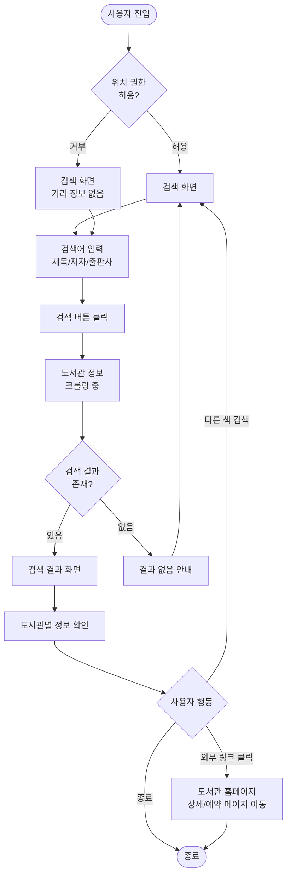

# 도서관 도서 검색 서비스 기획안

## 1. 서비스 개요

### 서비스명
**책찾다** (가칭)

#### 서비스명 대안
서비스명은 사용자에게 서비스의 핵심 가치를 직관적으로 전달하고, 기억하기 쉬우며, 브랜드로서의 확장성을 가져야 합니다.

**네이밍 고려 요소**:
- **직관성**: 서비스 내용을 바로 이해할 수 있는가
- **기억성**: 짧고 발음하기 쉬우며 기억에 남는가
- **친근함**: 모든 연령대가 부담없이 사용할 수 있는가
- **확장성**: 향후 서비스 확장 시에도 어울리는가
- **차별성**: 기존 서비스와 구분되는가

**서비스명 후보**:

1. **책찾다** (현재안)
   - 장점: 직관적, 행동 지향적, 친근함
   - 고려: 일반적인 표현

2. **책나침반**
   - 장점: 방향을 알려준다는 의미, 독창적
   - 고려: 다소 은유적

3. **북파인더** (BookFinder)
   - 장점: 글로벌 확장성, 명확한 의미
   - 고려: 영어 표현

4. **도서관지도**
   - 장점: 지역 기반 서비스 강조, 명확
   - 고려: 다소 길고 설명적

5. **책여기**
   - 장점: 짧고 간결, 위치 기반 강조
   - 고려: 캐주얼한 느낌

**최종 결정**: 향후 사용자 테스트 및 브랜딩 전략 수립 후 확정 예정

### 한 줄 소개
송파구 내 24개 도서관의 도서 소장 및 대출 가능 여부를 한 번에 검색하는 통합 검색 서비스

### 서비스 목적
특정 도서관에 원하는 책이 없을 때 다른 도서관 홈페이지를 일일이 방문해야 하는 번거로움을 해소하고, 사용자가 가장 빠르게 원하는 책을 찾을 수 있도록 돕는다.

---

## 2. 문제 정의 및 해결 방안

### 현재 사용자가 겪는 문제점

1. **도서관별 개별 검색의 번거로움**
   - 읽고 싶은 책이 가까운 도서관에 없을 경우, 다른 도서관 홈페이지를 일일이 방문하여 검색해야 함
   - 각 도서관마다 다른 UI/UX로 인해 검색 방법을 매번 새로 익혀야 함

2. **실시간 대출 가능 여부 확인의 어려움**
   - 소장하고 있더라도 대출 중인 경우가 많아 직접 방문 전까지 확인하기 어려움
   - 여러 도서관을 돌아다녀야 하는 시간 낭비 발생

3. **정보 비교의 불편함**
   - 여러 도서관의 소장 정보를 한눈에 비교할 수 없음
   - 어느 도서관이 집에서 가까운지 일일이 확인해야 함

### 본 서비스의 해결 방법

- **통합 검색**: 책 제목, 저자, 출판사 키워드로 송파구 내 24개 도서관의 소장 및 대출 현황을 한 번에 조회
- **실시간 정보 제공**: 각 도서관의 실시간 대출 가능 상태를 수집하여 즉시 확인
- **다양한 도서관 유형**: 공공도서관, 작은 도서관, 24시간 스마트도서관까지 모두 포함
- **위치 기반 정렬**: 사용자 위치 기반으로 가까운 도서관 순으로 정렬하여 효율적인 방문 계획 수립 가능

---

## 2-1. 경쟁 서비스 분석

### 국내 유사 서비스 현황

현재 국내에는 도서관 관련 통합 서비스들이 이미 존재하지만, 각각 다른 목적과 한계를 가지고 있습니다.

#### 책바다 (상호대차 서비스)
- **운영 주체**: 국립중앙도서관
- **서비스 개요**: 전국 협약 도서관 간 자료 상호대차 서비스
- **주요 기능**:
  - 소속 도서관에 없는 책을 다른 도서관에서 신청
  - 1인당 최대 3권, 대출 기간 14일
  - 배송 시스템 기반 (택배 이용)
- **이용 비용**: 배송비 이용자 부담 (서울시 일부 지원: 약 3,840원)
- **참여 도서관**: 서울시 192개 공공도서관 포함
- **한계**:
  - 배송 기반으로 즉시 열람 불가
  - 실시간 검색보다는 신청 후 대기 방식
  - 배송비 부담
  - 대출 가능한 책의 위치를 직접 확인하고 방문하기 어려움

#### 리브로피아 (모바일 도서관 앱)
- **서비스 개요**: 전국 공공·대학 도서관 연결 모바일 앱
- **주요 기능**:
  - 전국 350여 개 도서관 정보 제공
  - 전자책 대출 및 내 서재 관리
  - 모바일 회원증 발급
  - 열람실 좌석 실시간 확인
  - 도서 예약 및 반납 연기
- **한계**:
  - 전자책 중심 서비스
  - 물리적 책의 실시간 대출 가능 여부 확인 제한적
  - 여러 도서관의 소장 정보를 한눈에 비교하기 어려움
  - 지역 특화 기능 부족

#### 서울시 도서관 통합검색
- **운영 주체**: 서울도서관
- **서비스 개요**: 서울시 공공도서관 통합 검색
- **주요 기능**:
  - 서울시 192개 공공도서관 자료 검색
  - 전자도서 중심 통합검색
- **한계**:
  - 서울시 전역 대상으로 특정 지역(구 단위) 최적화 부족
  - 위치 기반 정렬 기능 미흡
  - 스마트도서관 정보 통합 미흡
  - 실시간 대출 가능 여부 확인의 정확도 낮음

### 본 서비스의 차별화 포인트

#### 1. 지역 특화 전략
- **초점**: 송파구 24개 도서관 집중 최적화
- **장점**: 
  - 깊이 있는 지역 데이터 제공
  - 실제 이용 가능한 가까운 도서관 중심
  - 지역 주민의 실제 이용 패턴 반영

#### 2. 실시간 대출 가능 여부
- **차별점**: 즉시 대출 가능한 책만 필터링 가능
- **장점**:
  - 불필요한 도서관 방문 감소
  - 실제 이용 가능한 정보만 제공
  - 시간 절약 극대화

#### 3. 위치 기반 스마트 정렬
- **기능**: 사용자 현재 위치에서 가까운 도서관 순 자동 정렬
- **장점**:
  - 방문 동선 최적화
  - 거리 정보 실시간 제공
  - 효율적인 방문 계획 수립

#### 4. 다양한 도서관 유형 통합
- **포함**: 공공도서관 14개 + 스마트도서관 9개 + 교육청도서관 1개
- **장점**:
  - 24시간 이용 가능한 스마트도서관 정보 제공
  - 다양한 이용 시간대 대응
  - 접근성 극대화

#### 5. 간편한 사용성
- **목표**: 한 번의 검색으로 모든 정보 확인
- **장점**:
  - 복잡한 회원가입 절차 최소화
  - 직관적인 UI/UX
  - 빠른 검색 결과 제공

### 경쟁 우위 요약

| 구분 | 책바다 | 리브로피아 | 서울시 통합검색 | 책찾다 (본 서비스) |
|---|---|---|---|---|
| 서비스 범위 | 전국 | 전국 350개 | 서울시 전역 | 송파구 특화 |
| 주요 기능 | 상호대차 배송 | 전자책 대출 | 통합 검색 | 실시간 검색+위치 기반 |
| 실시간 대출 정보 | ✗ | △ | △ | ✓ |
| 위치 기반 정렬 | ✗ | ✗ | △ | ✓ |
| 스마트도서관 포함 | ✗ | ✗ | △ | ✓ |
| 비용 | 배송비 부담 | 무료 | 무료 | 무료 |
| 즉시 이용 가능성 | 배송 대기 | 전자책만 즉시 | 방문 필요 | 방문 가능 도서관 즉시 확인 |

---

## 3. 타겟 사용자

### 주요 사용자층
모든 연령대의 독서 애호가 및 도서관 이용자

### 사용자 페르소나 및 시나리오

#### 페르소나 1: 직장인 김지은 (32세)
- **상황**: 퇴근 후 읽고 싶은 베스트셀러를 빌리고 싶음
- **문제**: 집 근처 도서관에 책이 없어 다른 도서관도 확인해보고 싶지만 일일이 검색하기 번거로움
- **해결**: 책찾다에서 제목을 검색하여 집 근처 3개 도서관 중 2km 거리에 있는 도서관에 대출 가능한 책이 있음을 확인하고 퇴근길에 방문

#### 페르소나 2: 대학생 박민수 (21세)
- **상황**: 과제를 위해 특정 전문 서적이 필요함
- **문제**: 학교 근처 공공도서관에 없어서 다른 구의 도서관까지 알아봐야 함
- **해결**: 제목으로 검색하여 인근 구의 도서관에 소장되어 있고 대출 가능함을 확인, 주말에 방문 계획

#### 페르소나 3: 주부 이현주 (45세)
- **상황**: 자녀와 함께 읽을 동화책을 찾고 있음
- **문제**: 여러 권의 책을 찾아야 하는데 도서관마다 일일이 검색하기 힘듦
- **해결**: 책찾다에서 원하는 책들을 차례로 검색하여 한 도서관에서 모두 빌릴 수 있는지 확인

---

## 3-1. 시장 환경 분석

### 도서관 이용 현황

#### 공공도서관 현황
한국의 공공도서관은 지속적으로 증가하고 있으며, 특히 서울시는 전국에서 가장 많은 공공도서관을 보유하고 있습니다.

- **서울시 공공도서관**: 약 192개 (2026년 기준)
- **송파구 도서관**: 24개 (공공도서관 14개, 스마트도서관 9개, 교육청도서관 1개)
- **도서관 접근성**: 서울시민의 도서관 도보 15분 이내 접근률 지속 향상

#### 도서관 이용 트렌드
- **모바일 우선**: 도서관 이용자의 모바일 앱 사용 증가
- **즉시성 중시**: 실시간 정보 확인 니즈 증가
- **편의성 요구**: 여러 도서관을 한 번에 검색하고 싶은 니즈
- **위치 기반 서비스**: 가까운 도서관 우선 이용 선호

### 독서 인구 및 트렌드

#### 독서 실태 (참고)
문화체육관광부의 「대한민국 독서 실태 조사」에 따르면:
- 국민의 도서관 이용률은 꾸준히 증가 추세
- 공공도서관 방문 목적: 도서 대출(60% 이상), 자료 열람, 독서 프로그램 참여 순
- 도서관 이용 시 불편 사항: 원하는 책이 없거나 대출 중인 경우, 도서관까지의 거리

#### 독서 행태 변화
- **종이책 수요 지속**: 여전히 종이책 선호도 높음
- **전자책 병행**: 전자책 이용도 증가하나 종이책과 병행
- **도서관 활용**: 구매보다 도서관 이용 선호 증가 (경제적 이유)
- **지역 도서관 중시**: 멀리 있는 대형 도서관보다 가까운 도서관 선호

### 디지털 전환 및 스마트 도서관

#### 스마트도서관 확산
- **24시간 운영**: 무인 자동화 도서관 확대
- **송파구 사례**: 9개 스마트도서관 운영 중
- **이용 패턴**: 야간 및 주말 이용자 증가
- **접근성 향상**: 주거 밀집 지역 내 소규모 도서관 배치

#### 디지털 서비스 수요
- **통합 플랫폼**: 여러 도서관 정보를 한 곳에서 확인하고 싶은 니즈
- **실시간 정보**: 방문 전 대출 가능 여부 사전 확인
- **모바일 최적화**: 언제 어디서나 검색 가능한 서비스
- **개인화**: 관심 도서관, 위치 기반 맞춤 서비스

### 시장 기회

#### 충족되지 않은 니즈
1. **지역 특화 서비스 부재**
   - 전국 단위 서비스는 있으나 특정 지역 최적화 부족
   - 실제 이용 가능한 가까운 도서관 중심 서비스 필요

2. **실시간 정보 부족**
   - 소장 여부는 확인 가능하나 실시간 대출 가능 여부 확인 어려움
   - 직접 방문 또는 개별 도서관 홈페이지 확인 필요

3. **불편한 사용자 경험**
   - 여러 도서관 홈페이지를 각각 방문해야 함
   - 일관되지 않은 UI/UX
   - 비교 및 선택 과정의 복잡성

#### 목표 시장 규모
- **1차 타겟**: 송파구 주민 (약 66만 명, 2026년 기준)
- **잠재 이용자**: 도서관 이용 경험자 및 잠재 이용자
- **확장 가능성**: 인접 구(강남, 강동, 광진 등)로 확대 가능

### 참고 자료 출처

본 시장 환경 분석은 다음 기관의 공개 데이터 및 보고서를 참고하였습니다:

- **문화체육관광부**: 대한민국 독서 실태 조사
- **국립중앙도서관**: 공공도서관 통계 및 운영 현황
- **서울시 및 송파구**: 도서관 운영 현황 및 이용 통계
- **도서관정보나루**: 도서관 통계 데이터

---

## 4. 핵심 기능 (MVP 범위)

### 4.1 도서 검색 기능

#### 검색 방식
- **제목 검색**: 책 제목 키워드로 검색
- **저자 검색**: 저자명으로 검색
- **출판사 검색**: 출판사명으로 검색

사용자는 검색 옵션(제목/저자/출판사)을 선택한 후 키워드를 입력하여 검색할 수 있습니다.

#### 검색 대상
**송파구 전체 도서관 통합 검색 (총 24개)**

- **송파구통합도서관 시스템 (23개)**
  - 공공도서관 14개: 송파글마루, 송파어린이, 송파위례, 거마, 돌마리, 소나무언덕1~4호, 잠실본동, 송파어린이영어, 가락몰, 송이골도서관
  - 스마트도서관 9개
- **서울시교육청 송파도서관 (1개)**

초기 MVP에서 송파구 전역의 모든 주요 도서관을 대상으로 서비스 제공

### 4.2 검색 결과 표시

#### 도서 정보
- 책 표지 이미지
- 제목, 저자, 출판사, 출판년도
- ISBN
- 책 소개 요약

#### 도서관별 소장/대출 정보
각 도서관마다 다음 정보 표시:
- **도서관명** (도서관 유형 표시: 공공/스마트/교육청)
- **거리 정보**: 사용자 위치로부터의 거리 (km)
- **소장 여부**: 소장함 / 미소장
- **대출 가능 상태**: 
  - 대출 가능
  - 대출 중 (반납 예정일 표시)
  - 관내 열람만 가능
- **운영 시간**: 일반 운영 / 24시간 운영 (스마트도서관)
- **도서관 연락처 및 주소**
- **해당 도서관 도서 상세 페이지 링크**: 예약 또는 추가 정보 확인을 위한 외부 링크

### 4.3 위치 기반 정렬

- 사용자의 현재 위치 정보 활용 (위치 권한 요청)
- 가까운 도서관 순으로 자동 정렬
- 거리 정보 표시 (km 단위)

### 4.4 부가 기능

- **최근 검색어**: 사용자의 최근 검색 기록 표시 (선택사항, 로컬 저장)
- **에러 처리**: 검색 결과 없음, 네트워크 오류 등에 대한 안내 메시지

---

## 5. 서비스 플로우

### 전체 사용자 여정



### 주요 시나리오별 상세 플로우

#### 시나리오 1: 성공적인 검색 및 대출 가능 도서 발견
1. 사용자가 서비스에 접속
2. 위치 권한 허용
3. 검색창에 책 제목 "멋진 신세계" 입력
4. 검색 버튼 클릭
5. 로딩 화면 (3-5초)
6. 결과 화면 표시: 3개 도서관 정보 (거리 순)
7. 1.2km 거리의 A도서관에 대출 가능 상태 확인
8. A도서관 상세보기 클릭하여 도서관 홈페이지로 이동
9. 예약 또는 방문 계획 수립

#### 시나리오 2: 검색 결과는 있으나 모두 대출 중
1. 사용자가 저자명으로 검색
2. 결과 화면에 2개 도서관 정보 표시
3. 모두 "대출 중" 상태 (반납 예정일 표시)
4. 가장 빠른 반납 예정일의 도서관을 선택하여 예약 링크로 이동

#### 시나리오 3: 검색 결과 없음
1. 사용자가 희귀 도서 제목으로 검색
2. 결과 없음 메시지 표시
3. "다시 검색하기" 버튼 클릭하여 검색 화면으로 복귀

---

## 6. 화면 구성

### 6.1 검색 화면 (메인 화면)

#### 화면 구성 요소
- **헤더 영역**
  - 서비스 로고 및 서비스명
  - 위치 정보 표시 (사용자가 선택한 구/군 또는 현재 위치)

- **검색 영역** (중앙 배치)
  - 검색창 (텍스트 입력)
    - 플레이스홀더: "검색어를 입력하세요"
  - 검색 옵션 선택
    - 라디오 버튼: 제목 / 저자 / 출판사
  - 검색 버튼

- **최근 검색어 영역** (선택사항)
  - 최근 검색한 키워드 목록 (3-5개)
  - 클릭 시 재검색

- **안내 메시지**
  - 서비스 사용 방법 간단 안내
  - 지원 지역 안내: "송파구 내 24개 도서관 통합 검색 서비스"
  - 포함 도서관: 공공도서관 14개, 스마트도서관 9개, 교육청도서관 1개

### 6.2 검색 결과 화면

#### 화면 구성 요소

**상단: 도서 정보 요약 카드**
- 책 표지 이미지 (좌측)
- 도서 정보 (우측)
  - 제목 (볼드, 큰 글씨)
  - 저자
  - 출판사, 출판년도
  - ISBN
  - 간단한 책 소개 (2-3줄)

**중단: 필터 및 정렬 옵션**
- 정렬 방식 선택: 거리 순 / 대출 가능 우선
- 대출 가능만 보기 체크박스

**하단: 도서관 목록**
각 도서관을 카드 형태로 표시 (리스트 뷰):

- **도서관 카드 구성**
  - 도서관명 (헤더)
  - 도서관 유형 표시: 공공도서관 / 스마트도서관(24H) / 교육청도서관
  - 거리 정보: "1.2km" (아이콘과 함께)
  - 소장 여부 배지
    - 소장함 (녹색)
    - 미소장 (회색)
  - 대출 가능 상태 배지
    - 대출 가능 (녹색, 눈에 띄게)
    - 대출 중 (빨간색, 반납 예정일 표시)
    - 관내 열람만 (노란색)
  - 운영 시간 표시 (스마트도서관의 경우 "24시간 운영" 강조)
  - 도서관 주소 및 연락처
  - 버튼 영역
    - "상세보기" 버튼: 도서관 홈페이지 해당 도서 페이지로 이동
    - "예약하기" 버튼: 도서관 예약 페이지로 이동 (가능한 경우)

**하단 버튼**
- "다른 책 검색하기" 버튼

### 6.3 로딩 화면

- 로딩 스피너 또는 프로그레스바
- 안내 메시지: "도서관 정보를 불러오는 중입니다..."
- 예상 소요 시간: 3-5초

### 6.4 에러/빈 결과 화면

#### 검색 결과 없음
- 안내 아이콘 (책 또는 검색 아이콘)
- 메시지: "죄송합니다. 검색 결과가 없습니다."
- 서브 메시지: "다른 키워드로 다시 검색해 보세요."
- "다시 검색하기" 버튼

#### 네트워크 오류
- 오류 아이콘
- 메시지: "네트워크 연결을 확인해 주세요."
- "다시 시도" 버튼

#### 위치 권한 거부
- 안내 메시지: "위치 권한이 거부되어 거리 정보를 제공할 수 없습니다."
- "거리 정보 없이 계속하기" 버튼
- "설정에서 권한 허용하기" 안내

---

## 7. 향후 확장 계획

### Phase 2: 알림 기능
- **대출 가능 알림**: 현재 대출 중인 책이 반납되면 사용자에게 알림
- **신간 알림**: 관심 분야의 신간이 도서관에 입고되면 알림
- **예약 순서 알림**: 예약한 책의 순서가 다가오면 알림

### Phase 3: 사용자 기능 강화
- **검색 이력 저장**: 로그인 기반 검색 이력 클라우드 저장
- **즐겨찾기 도서관**: 자주 가는 도서관을 즐겨찾기로 등록
- **위시리스트**: 읽고 싶은 책 목록 관리
- **읽은 책 기록**: 독서 이력 관리

### Phase 4: 서비스 대상 확대
- **대학도서관 추가**: 대학도서관 소장 정보 포함 (외부인 이용 가능 여부 표시)
- **전문도서관 추가**: 특정 분야 전문도서관 정보 추가

### Phase 5: 지역 확대
- **인접 구 확대**: 송파구에서 강남구, 강동구, 광진구 등 인접 지역으로 확대
- **서울시 전역 확대**: 서울시 전체 자치구 공공도서관 통합
- **전국 단위 확대**: 전국의 모든 공공도서관으로 서비스 확대
- **지역별 검색**: 사용자가 원하는 지역 선택 가능

### Phase 6: 커뮤니티 기능
- **도서 리뷰 및 평점**: 사용자들이 책에 대한 리뷰와 평점 작성
- **독서 모임**: 지역별 독서 모임 정보 공유
- **추천 시스템**: 사용자의 독서 이력 기반 도서 추천

### Phase 7: 데이터 분석 및 인사이트
- **인기 도서 통계**: 지역별, 연령별 인기 도서 분석
- **도서관 이용 패턴**: 도서관별 이용률 및 추천 방문 시간대 제공

---

## 8. 기대 효과

### 사용자 측면
- **시간 절약**: 여러 도서관을 일일이 검색하는 시간 절약 (24개 도서관 한 번에 검색)
- **편의성 향상**: 한 번의 검색으로 원하는 정보를 모두 확인
- **접근성 개선**: 도서관 이용 장벽 낮춤
- **24시간 이용 가능**: 스마트도서관 정보 포함으로 야간 및 주말에도 책 이용 가능

### 도서관 측면
- **이용률 증가**: 더 많은 사용자가 도서관 자원을 활용
- **자원 최적화**: 지역 내 도서관 간 자원 공유 활성화

### 사회적 측면
- **독서 문화 활성화**: 도서 접근성 향상으로 독서 인구 증가
- **공공 자원 활용 극대화**: 세금으로 운영되는 도서관의 효율적 활용

---

## 9. 데이터 수집 방식

본 서비스는 각 도서관의 소장 및 대출 정보를 실시간으로 제공하기 위해 다음과 같은 방식으로 데이터를 수집합니다:

### 데이터 수집 전략

**1. 송파구통합도서관 시스템 활용**
- **대상**: 공공도서관 14개 + 스마트도서관 9개 (총 23개)
- **방식**: 송파구통합도서관 통합검색 시스템 활용
- **장점**: 
  - 하나의 검색으로 23개 도서관 정보 동시 수집
  - 각 도서관별 소장 여부 및 대출 상태 자동 구분
  - 데이터 형식 통일로 파싱 및 처리 용이
  - 스마트도서관 포함으로 24시간 이용 가능한 도서관 정보도 제공

**2. 서울시교육청 송파도서관**
- **대상**: 서울시교육청 송파도서관 (1개)
- **방식**: 별도 API 또는 웹 크롤링
- **특징**: 교육청 운영 도서관으로 학생 및 교육 자료 특화

**3. 공공 API 우선 활용**
- 국가도서관정보시스템(KOLIS-NET), 도서관정보나루 등 통합 API가 있는 경우 우선 활용
- 각 지자체에서 제공하는 공공데이터 포털의 도서관 API 사용

**4. 웹 크롤링 (보조 수단)**
- API가 제공되지 않는 경우 웹 크롤링을 통해 데이터 수집
- 각 도서관 홈페이지의 검색 결과 페이지에서 소장 여부 및 대출 상태 정보 추출

### 송파구 통합 시스템의 기술적 이점
- **효율성**: 1~2회 검색으로 24개 도서관 정보 수집
- **일관성**: 통합 시스템으로 데이터 형식 및 업데이트 주기 통일
- **확장성**: 향후 송파구 내 도서관 추가 시 자동 반영 가능
- **실시간성**: 공공도서관과 스마트도서관의 실시간 대출 정보 동시 제공

### 고려사항
- 각 도서관의 데이터 제공 정책 및 이용 약관 준수
- 크롤링 빈도 조절로 도서관 서버 부하 최소화
- 데이터 신뢰성 확보를 위한 주기적 업데이트 및 검증
- 송파구 및 서울시교육청과의 데이터 활용 협의

---

## 9-1. 기술 실현 방안

### 도서관정보나루 API 상세

도서관정보나루(Data4Library)는 공공도서관 정보를 제공하는 공식 Open API 서비스입니다.

#### 제공 API 목록

| API 이름 | 기능 | 활용 가능성 |
|---|---|---|
| `libSrch` | 도서관 기본 정보 조회 | 도서관 목록, 주소, 연락처, 홈페이지 정보 수집 |
| `itemSrch` | 도서관 장서/대출 정보 조회 | 특정 도서관의 소장 도서 검색 |
| `bookExist` | 도서관별 소장 여부 조회 | ISBN 기반 특정 도서관 소장 여부 확인 |
| `loanItemSrch` | 인기 대출 도서 조회 | 지역별, 연령별 인기 도서 통계 |
| `srchDtlList` | 도서 상세 정보 조회 | ISBN 기반 서지정보, 표지 이미지 등 |

#### API 인증 및 사용 방법

**인증키 발급**:
- 공공데이터포털 또는 도서관정보나루 사이트에서 신청
- 무료로 제공되는 authKey 발급

**API 호출 예시**:
```
http://data4library.kr/api/bookExist?authKey=[인증키]&isbn=9788937460883&libCode=111001
```

**응답 형식**:
- 주로 XML 형식으로 제공
- 파싱을 통해 필요한 데이터 추출

**활용 방안**:
- 도서관 기본 정보 수집: 주소, 연락처, 운영 시간
- ISBN 기반 소장 여부 확인
- 도서 상세 정보(표지, 서지정보) 수집
- 보조 데이터로 활용 (주요 데이터는 도서관 홈페이지 크롤링)

### 웹 크롤링 기술 스택

실시간 대출 가능 여부를 확인하기 위해서는 각 도서관 홈페이지의 웹 크롤링이 필수적입니다.

#### 기술 스택 구성

**언어 및 프레임워크**:
- **Python**: 크롤링 및 데이터 처리의 표준 언어
- **Selenium**: 동적 웹페이지 자동화
  - JavaScript로 렌더링되는 검색 결과 처리
  - 로그인, 페이지 네비게이션 자동화
  - 검색폼 입력 및 제출
- **BeautifulSoup**: HTML 파싱 및 데이터 추출
  - 검색 결과 페이지 파싱
  - 도서 정보, 대출 상태 추출
- **webdriver-manager**: 브라우저 드라이버 자동 관리

**보조 라이브러리**:
- **requests**: 정적 페이지 요청 (API 호출)
- **pandas**: 데이터 정제 및 저장
- **schedule**: 주기적 크롤링 스케줄링

#### 크롤링 워크플로우

**1단계: 도서관 시스템 분석**
- 송파구통합도서관 및 교육청 도서관 검색 구조 분석
- 검색 요청 방식 (GET/POST), 파라미터 확인
- 결과 페이지 HTML 구조 파악

**2단계: 데이터 수집 자동화**
- Selenium으로 검색 페이지 접근
- 검색어 입력 및 검색 실행
- 동적 로딩 완료 대기 (WebDriverWait 사용)
- BeautifulSoup로 결과 페이지 파싱

**3단계: 데이터 추출**
- 도서관명, 소장 여부, 대출 가능 상태 추출
- 반납 예정일, 도서 위치 정보 수집
- 도서관 상세 페이지 링크 저장

**4단계: 데이터 저장 및 관리**
- 데이터베이스 저장 (PostgreSQL, MongoDB 등)
- 캐싱으로 응답 속도 향상
- 주기적 업데이트 (5-10분 간격)

#### 동적 페이지 처리 방안

**JavaScript 렌더링 처리**:
- Selenium 헤드리스 모드로 실제 브라우저 동작 시뮬레이션
- AJAX 요청 완료 대기
- 무한 스크롤, 페이징 자동 처리

**페이징 및 다중 결과 처리**:
- 검색 결과가 여러 페이지인 경우 자동 순회
- 모든 도서관의 결과 수집 완료까지 대기

**에러 핸들링**:
- 타임아웃 처리
- 도서관 사이트 접속 불가 시 재시도 로직
- 구조 변경 감지 및 알림

#### 성능 최적화

**동시성 처리**:
- 2개 도서관 시스템(송파구통합, 교육청) 병렬 크롤링
- 비동기 처리로 응답 시간 단축 (3-5초 목표)

**캐싱 전략**:
- 도서 기본 정보(표지, 서지정보) 캐싱
- 대출 상태만 주기적 업데이트
- Redis 등 인메모리 캐시 활용

**부하 관리**:
- 크롤링 요청 간격 조절 (Rate Limiting)
- User-Agent 설정으로 정상 사용자 시뮬레이션
- 도서관 서버 부하 최소화

---

## 부록

### 참고 사항
- 본 기획안은 MVP(Minimum Viable Product) 범위를 중심으로 작성되었습니다.
- MVP 대상: 송파구 내 24개 도서관 (공공도서관 14개, 스마트도서관 9개, 교육청도서관 1개)
- 실제 개발 시 송파구통합도서관 및 서울시교육청과 데이터 활용 협의가 필요합니다.
- 각 도서관의 API 제공 여부 및 크롤링 가능 여부를 사전 확인해야 합니다.
- 개인정보 보호 및 위치 정보 사용에 대한 법적 검토가 필요합니다.

### 변경 이력
- v1.0 (2026-01-21): 초안 작성
- v1.1 (2026-01-21): 검색 옵션 변경 (ISBN 제외, 제목/저자/출판사로 변경), 데이터 수집 방식 섹션 추가
- v1.2 (2026-01-21): MVP 범위 구체화 (송파구 내 24개 도서관으로 확정, 스마트도서관 9개 포함)
- v1.3 (2026-01-21): 도서관 분류 간소화 (작은 도서관을 공공도서관에 통합, 공공도서관 14개로 수정)
- v1.4 (2026-01-21): 웹 리서치 기반 보완 (경쟁 서비스 분석, 시장 환경 분석, 기술 실현 방안 상세화, 서비스명 대안 제시)
