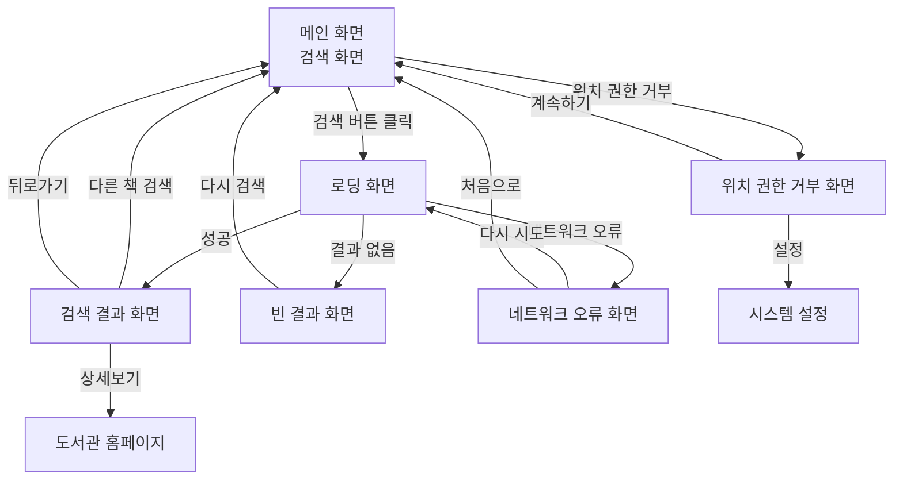

# 송파구 도서관 책크 - 와이어프레임

> 본 문서는 도서관 도서 검색 서비스 "송파구 도서관 책크"의 주요 화면 와이어프레임을 포함하고 있습니다.

## 목차
1. [메인 화면 (검색 화면)](#1-메인-화면-검색-화면)
2. [검색 결과 화면](#2-검색-결과-화면)
3. [로딩 화면](#3-로딩-화면)
4. [에러/빈 결과 화면](#4-에러빈-결과-화면)

---

## 1. 메인 화면 (검색 화면)

### 화면 설명
서비스의 진입점으로, 사용자가 도서를 검색할 수 있는 메인 화면입니다. 제목, 저자, 출판사 중 하나를 선택하여 검색할 수 있습니다.

### 와이어프레임

```
┌────────────────────────────────────────────────────────────┐
│                    📱 Mobile View (375px)                   │
├────────────────────────────────────────────────────────────┤
│                                                              │
│  ┌──────────────────────────────────────────────────────┐  │
│  │  [📚]  송파구 도서관 책크                              │  │
│  │                                        📍 송파구       │  │
│  └──────────────────────────────────────────────────────┘  │
│                                                              │
│                                                              │
│  ┌──────────────────────────────────────────────────────┐  │
│  │                                                        │  │
│  │    "송파구 내 24개 도서관을 한 번에 검색하세요"       │  │
│  │                                                        │  │
│  └──────────────────────────────────────────────────────┘  │
│                                                              │
│                                                              │
│  ┌──────────────────────────────────────────────────────┐  │
│  │  검색 옵션 선택:                                       │  │
│  │                                                        │  │
│  │  ⦿ 제목    ○ 저자    ○ 출판사                        │  │
│  └──────────────────────────────────────────────────────┘  │
│                                                              │
│  ┌──────────────────────────────────────────────────────┐  │
│  │  🔍  검색어를 입력하세요                           │  │
│  │                                                        │  │
│  └──────────────────────────────────────────────────────┘  │
│                                                              │
│  ┌──────────────────────────────────────────────────────┐  │
│  │                    [ 검색하기 ]                        │  │
│  └──────────────────────────────────────────────────────┘  │
│                                                              │
│                                                              │
│  ───────────────────────────────────────────────────────   │
│                                                              │
│  최근 검색어                                                │
│  ┌──────────┐ ┌──────────┐ ┌──────────┐                   │
│  │ 멋진신세계│ │ 해리포터  │ │ 코스모스  │                  │
│  └──────────┘ └──────────┘ └──────────┘                   │
│                                                              │
│                                                              │
│  ───────────────────────────────────────────────────────   │
│                                                              │
│  📚 서비스 안내                                             │
│  • 송파구 내 24개 도서관 통합 검색                          │
│  • 공공도서관 14개 + 스마트도서관 9개 + 교육청도서관 1개    │
│  • 실시간 대출 가능 여부 확인                               │
│  • 위치 기반 가까운 도서관 순 정렬                          │
│                                                              │
│                                                              │
└────────────────────────────────────────────────────────────┘
```

### 주요 UI 요소

#### 헤더
- **서비스 로고**: 책 아이콘 + "송파구 도서관 책크"
- **위치 정보**: 사용자 현재 위치 (송파구) 표시

#### 검색 영역
- **검색 옵션**: 라디오 버튼 (제목/저자/출판사)
- **검색창**: 텍스트 입력 필드 (플레이스홀더: "검색어를 입력하세요")
- **검색 버튼**: 큰 CTA 버튼

#### 최근 검색어
- 최근 검색한 키워드 3-5개를 칩(chip) 형태로 표시
- 클릭 시 해당 키워드로 재검색

#### 안내 메시지
- 서비스 설명 및 지원하는 도서관 수 안내
- 주요 기능 간단 설명

### 사용자 인터랙션
1. 검색 옵션 선택 (제목/저자/출판사)
2. 검색창에 키워드 입력
3. 검색 버튼 클릭 또는 엔터키
4. 최근 검색어 클릭 시 재검색

---

## 2. 검색 결과 화면

### 화면 설명
검색 결과를 표시하는 화면으로, 상단에 도서 정보 요약 카드, 중단에 필터/정렬 옵션, 하단에 도서관별 소장/대출 정보 리스트를 표시합니다.

### 와이어프레임

```
┌────────────────────────────────────────────────────────────┐
│                    📱 Mobile View (375px)                   │
├────────────────────────────────────────────────────────────┤
│                                                              │
│  ┌──────────────────────────────────────────────────────┐  │
│  │  [←]  송파구 도서관 책크                    🔍 새검색  │  │
│  └──────────────────────────────────────────────────────┘  │
│                                                              │
│  ═══════════════════════════════════════════════════════   │
│  ┌──────────────────────────────────────────────────────┐  │
│  │ ┌──────┐                                              │  │
│  │ │      │  멋진 신세계                                 │  │
│  │ │ 표지 │  올더스 헉슬리 저 | 소담출판사               │  │
│  │ │ 이미지│  출판년도: 2015                              │  │
│  │ │      │  ISBN: 9788956050546                         │  │
│  │ └──────┘                                              │  │
│  │                                                        │  │
│  │  디스토피아 소설의 고전. 미래 사회에서 인간의...     │  │
│  └──────────────────────────────────────────────────────┘  │
│  ═══════════════════════════════════════════════════════   │
│                                                              │
│  ┌──────────────────────────────────────────────────────┐  │
│  │  정렬: [거리순 ▼]  ☐ 대출 가능만 보기                │  │
│  └──────────────────────────────────────────────────────┘  │
│                                                              │
│  검색 결과: 3개 도서관에서 소장 중                           │
│                                                              │
│  ┌──────────────────────────────────────────────────────┐  │
│  │ 📍 송파글마루도서관               [공공] 1.2km        │  │
│  │ ─────────────────────────────────────────────────    │  │
│  │ [✓ 소장함]  [✓ 대출 가능]                            │  │
│  │                                                        │  │
│  │ 🕐 09:00-22:00 (월-금) / 09:00-18:00 (주말)          │  │
│  │ 📞 02-2147-2800                                       │  │
│  │ 📍 서울시 송파구 송이로 10                             │  │
│  │                                                        │  │
│  │ [ 상세보기 ]  [ 예약하기 ]                            │  │
│  └──────────────────────────────────────────────────────┘  │
│                                                              │
│  ┌──────────────────────────────────────────────────────┐  │
│  │ 📍 송파위례도서관                [공공] 2.5km         │  │
│  │ ─────────────────────────────────────────────────    │  │
│  │ [✓ 소장함]  [✗ 대출 중]  (반납예정: 2026-01-28)      │  │
│  │                                                        │  │
│  │ 🕐 09:00-22:00 (월-금) / 09:00-18:00 (주말)          │  │
│  │ 📞 02-2147-3900                                       │  │
│  │ 📍 서울시 송파구 송파대로 48길 4                       │  │
│  │                                                        │  │
│  │ [ 상세보기 ]  [ 예약하기 ]                            │  │
│  └──────────────────────────────────────────────────────┘  │
│                                                              │
│  ┌──────────────────────────────────────────────────────┐  │
│  │ 📍 잠실스마트도서관            [스마트24H] 3.1km       │  │
│  │ ─────────────────────────────────────────────────    │  │
│  │ [✓ 소장함]  [⚠ 관내열람만]                           │  │
│  │                                                        │  │
│  │ 🕐 24시간 운영 (무인 자동화)                          │  │
│  │ 📞 02-2147-2800                                       │  │
│  │ 📍 서울시 송파구 백제고분로 270                        │  │
│  │                                                        │  │
│  │ [ 상세보기 ]                                          │  │
│  └──────────────────────────────────────────────────────┘  │
│                                                              │
│                                                              │
│  ┌──────────────────────────────────────────────────────┐  │
│  │              [ 🔍 다른 책 검색하기 ]                   │  │
│  └──────────────────────────────────────────────────────┘  │
│                                                              │
│                                                              │
└────────────────────────────────────────────────────────────┘
```

### 주요 UI 요소

#### 헤더
- **뒤로가기 버튼**: 검색 화면으로 복귀
- **서비스명**: 송파구 도서관 책크
- **새검색 버튼**: 검색 화면으로 이동

#### 도서 정보 요약 카드
- **표지 이미지**: 좌측에 배치
- **도서 정보**: 제목(볼드), 저자, 출판사, 출판년도, ISBN
- **책 소개**: 간단한 설명 2-3줄

#### 필터 및 정렬 옵션
- **정렬 드롭다운**: 거리순 / 대출 가능 우선
- **필터 체크박스**: 대출 가능만 보기

#### 도서관 카드 리스트
각 도서관 정보를 카드 형태로 표시:
- **도서관명 + 거리**: 헤더 영역
- **도서관 유형 배지**: [공공] / [스마트24H] / [교육청]
- **소장 여부 배지**: [✓ 소장함] / [✗ 미소장]
- **대출 상태 배지**: 
  - [✓ 대출 가능] (녹색)
  - [✗ 대출 중] + 반납 예정일 (빨간색)
  - [⚠ 관내열람만] (노란색)
- **운영 시간**: 아이콘 + 시간 정보
- **연락처 및 주소**: 아이콘 + 텍스트
- **버튼**: 상세보기, 예약하기 (가능한 경우)

#### 하단 버튼
- **다른 책 검색하기**: 검색 화면으로 복귀

### 배지 색상 가이드
- ✓ 대출 가능: 녹색 배경 (#4CAF50)
- ✗ 대출 중: 빨간색 배경 (#F44336)
- ⚠ 관내열람만: 노란색 배경 (#FFC107)
- [공공]: 파란색 배경 (#2196F3)
- [스마트24H]: 보라색 배경 (#9C27B0)
- [교육청]: 주황색 배경 (#FF9800)

### 사용자 인터랙션
1. 정렬 방식 변경 (거리순 ↔ 대출 가능 우선)
2. 대출 가능만 보기 필터 적용
3. 도서관 카드의 "상세보기" 클릭 → 도서관 홈페이지로 이동
4. 도서관 카드의 "예약하기" 클릭 → 도서관 예약 페이지로 이동
5. "다른 책 검색하기" 클릭 → 검색 화면으로 복귀

---

## 3. 로딩 화면

### 화면 설명
사용자가 검색 버튼을 클릭한 후 도서관 정보를 수집하는 동안 표시되는 로딩 화면입니다.

### 와이어프레임

```
┌────────────────────────────────────────────────────────────┐
│                    📱 Mobile View (375px)                   │
├────────────────────────────────────────────────────────────┤
│                                                              │
│  ┌──────────────────────────────────────────────────────┐  │
│  │  송파구 도서관 책크                                     │  │
│  └──────────────────────────────────────────────────────┘  │
│                                                              │
│                                                              │
│                                                              │
│                                                              │
│                                                              │
│                         ⌛                                  │
│                    (로딩 스피너)                             │
│                                                              │
│                                                              │
│                  도서관 정보를                               │
│                  불러오는 중입니다...                         │
│                                                              │
│                                                              │
│                  ▓▓▓▓▓▓▓▓▓░░░░░░░                          │
│                     (프로그레스바)                           │
│                                                              │
│                                                              │
│                  예상 소요 시간: 3-5초                       │
│                                                              │
│                                                              │
│                  📚 송파구 24개 도서관의                     │
│                     소장 정보를 확인 중...                   │
│                                                              │
│                                                              │
│                                                              │
│                                                              │
│                                                              │
│                                                              │
│                                                              │
└────────────────────────────────────────────────────────────┘
```

### 주요 UI 요소

#### 헤더
- **서비스명**: 송파구 도서관 책크

#### 로딩 영역 (중앙 배치)
- **로딩 스피너**: 회전하는 애니메이션 아이콘
- **안내 메시지**: "도서관 정보를 불러오는 중입니다..."
- **프로그레스바**: 진행 상황 시각화
- **예상 소요 시간**: "예상 소요 시간: 3-5초"
- **서브 메시지**: "송파구 24개 도서관의 소장 정보를 확인 중..."

### 애니메이션
- 로딩 스피너: 360도 회전 애니메이션
- 프로그레스바: 좌→우 진행 애니메이션
- 페이드 인/아웃 효과

---

## 4. 에러/빈 결과 화면

### 화면 설명
검색 결과가 없거나 오류가 발생했을 때 표시되는 화면입니다. 상황별로 다른 메시지와 액션을 제공합니다.

### 4.1 검색 결과 없음

```
┌────────────────────────────────────────────────────────────┐
│                    📱 Mobile View (375px)                   │
├────────────────────────────────────────────────────────────┤
│                                                              │
│  ┌──────────────────────────────────────────────────────┐  │
│  │  [←]  송파구 도서관 책크                                │  │
│  └──────────────────────────────────────────────────────┘  │
│                                                              │
│                                                              │
│                                                              │
│                                                              │
│                         📖❌                                │
│                    (책 + X 아이콘)                          │
│                                                              │
│                                                              │
│               죄송합니다.                                    │
│            검색 결과가 없습니다.                              │
│                                                              │
│                                                              │
│        송파구 내 24개 도서관에                               │
│        해당 도서가 소장되어 있지 않습니다.                    │
│                                                              │
│                                                              │
│        • 검색어를 다시 확인해 주세요                         │
│        • 다른 키워드로 검색해 보세요                         │
│        • 저자명이나 출판사로 검색해 보세요                   │
│                                                              │
│                                                              │
│  ┌──────────────────────────────────────────────────────┐  │
│  │              [ 🔍 다시 검색하기 ]                       │  │
│  └──────────────────────────────────────────────────────┘  │
│                                                              │
│                                                              │
│                                                              │
└────────────────────────────────────────────────────────────┘
```

### 4.2 네트워크 오류

```
┌────────────────────────────────────────────────────────────┐
│                    📱 Mobile View (375px)                   │
├────────────────────────────────────────────────────────────┤
│                                                              │
│  ┌──────────────────────────────────────────────────────┐  │
│  │  [←]  송파구 도서관 책크                                │  │
│  └──────────────────────────────────────────────────────┘  │
│                                                              │
│                                                              │
│                                                              │
│                                                              │
│                         ⚠️                                  │
│                    (경고 아이콘)                             │
│                                                              │
│                                                              │
│               네트워크 오류                                  │
│                                                              │
│                                                              │
│        인터넷 연결을 확인해 주세요.                          │
│                                                              │
│        도서관 정보를 불러올 수 없습니다.                      │
│                                                              │
│                                                              │
│        • Wi-Fi 또는 모바일 데이터 연결 확인                  │
│        • 잠시 후 다시 시도해 주세요                          │
│                                                              │
│                                                              │
│  ┌──────────────────────────────────────────────────────┐  │
│  │              [ 🔄 다시 시도 ]                           │  │
│  └──────────────────────────────────────────────────────┘  │
│                                                              │
│  ┌──────────────────────────────────────────────────────┐  │
│  │              [ ← 처음으로 ]                             │  │
│  └──────────────────────────────────────────────────────┘  │
│                                                              │
│                                                              │
└────────────────────────────────────────────────────────────┘
```

### 4.3 위치 권한 거부

```
┌────────────────────────────────────────────────────────────┐
│                    📱 Mobile View (375px)                   │
├────────────────────────────────────────────────────────────┤
│                                                              │
│  ┌──────────────────────────────────────────────────────┐  │
│  │  [←]  송파구 도서관 책크                                │  │
│  └──────────────────────────────────────────────────────┘  │
│                                                              │
│                                                              │
│                                                              │
│                                                              │
│                         📍❌                                │
│                    (위치 + X 아이콘)                         │
│                                                              │
│                                                              │
│               위치 권한 거부됨                               │
│                                                              │
│                                                              │
│        위치 권한이 거부되어                                  │
│        거리 정보를 제공할 수 없습니다.                       │
│                                                              │
│                                                              │
│        거리 정보 없이도 검색은 가능하지만,                    │
│        가까운 도서관 순 정렬을 사용할 수 없습니다.            │
│                                                              │
│                                                              │
│  ┌──────────────────────────────────────────────────────┐  │
│  │         [ 거리 정보 없이 계속하기 ]                     │  │
│  └──────────────────────────────────────────────────────┘  │
│                                                              │
│  ┌──────────────────────────────────────────────────────┐  │
│  │         [ ⚙️ 설정에서 권한 허용 ]                       │  │
│  └──────────────────────────────────────────────────────┘  │
│                                                              │
│                                                              │
│                                                              │
└────────────────────────────────────────────────────────────┘
```

### 주요 UI 요소

#### 공통 요소
- **헤더**: 뒤로가기 버튼 + 서비스명
- **아이콘**: 상황별 아이콘 (중앙 배치, 큰 사이즈)
- **메시지**: 주요 메시지 (볼드, 큰 글씨)
- **설명**: 상세 설명 및 가이드 (작은 글씨)
- **액션 버튼**: 상황에 맞는 CTA 버튼

#### 검색 결과 없음
- 아이콘: 📖❌ (책 + X)
- 주요 메시지: "죄송합니다. 검색 결과가 없습니다."
- 가이드: 검색어 확인, 다른 키워드 제안
- 버튼: "다시 검색하기"

#### 네트워크 오류
- 아이콘: ⚠️ (경고)
- 주요 메시지: "네트워크 오류"
- 가이드: 인터넷 연결 확인 안내
- 버튼: "다시 시도", "처음으로"

#### 위치 권한 거부
- 아이콘: 📍❌ (위치 + X)
- 주요 메시지: "위치 권한 거부됨"
- 가이드: 거리 정보 제공 불가 안내
- 버튼: "거리 정보 없이 계속하기", "설정에서 권한 허용"

### 사용자 인터랙션

#### 검색 결과 없음
1. "다시 검색하기" 클릭 → 검색 화면으로 복귀

#### 네트워크 오류
1. "다시 시도" 클릭 → 동일한 검색 재시도
2. "처음으로" 클릭 → 검색 화면으로 복귀

#### 위치 권한 거부
1. "거리 정보 없이 계속하기" 클릭 → 검색 화면으로 이동 (거리 정보 미표시)
2. "설정에서 권한 허용" 클릭 → 시스템 설정으로 이동

---

## 화면 전환 플로우



---

## 반응형 디자인 고려사항

### 모바일 우선 (Mobile First)
- 기본 너비: 375px (iPhone SE 기준)
- 터치 타겟 크기: 최소 44x44px
- 폰트 크기: 최소 14px (본문), 18px 이상 (제목)

### 태블릿 (768px 이상)
- 2열 그리드 레이아웃 (도서관 카드)
- 사이드바 네비게이션 추가 가능

### 데스크톱 (1024px 이상)
- 3열 그리드 레이아웃
- 좌측 사이드바 + 우측 콘텐츠 영역
- 더 넓은 검색 옵션 및 필터 표시

---

## 색상 가이드

### 주요 색상
- **Primary**: #2196F3 (파란색) - 주요 버튼, 링크
- **Secondary**: #FF9800 (주황색) - 강조 요소
- **Success**: #4CAF50 (녹색) - 대출 가능
- **Warning**: #FFC107 (노란색) - 관내열람만
- **Error**: #F44336 (빨간색) - 대출 중, 오류

### 배경 색상
- **Background**: #FAFAFA (밝은 회색) - 전체 배경
- **Card**: #FFFFFF (흰색) - 카드 배경
- **Divider**: #E0E0E0 (회색) - 구분선

### 텍스트 색상
- **Primary Text**: #212121 (검은색) - 주요 텍스트
- **Secondary Text**: #757575 (회색) - 부가 정보
- **Disabled**: #BDBDBD (연한 회색) - 비활성화

---

## 접근성 고려사항

### WCAG 2.1 AA 준수
- 색상 대비비: 최소 4.5:1 (일반 텍스트), 3:1 (큰 텍스트)
- 키보드 네비게이션 지원
- 스크린 리더 호환성 (ARIA 레이블)
- 포커스 인디케이터 명확히 표시

### 사용자 편의성
- 명확한 에러 메시지
- 로딩 상태 명확히 표시
- 터치 영역 충분히 확보
- 간단하고 직관적인 UI

---

## 부록: 주요 UI 컴포넌트

### 버튼 스타일
```
Primary Button (CTA):
┌──────────────────────────┐
│      [ 검색하기 ]         │  ← 배경색: Primary, 텍스트: 흰색
└──────────────────────────┘

Secondary Button:
┌──────────────────────────┐
│      [ 상세보기 ]         │  ← 테두리: Primary, 텍스트: Primary
└──────────────────────────┘
```

### 배지 (Badge) 스타일
```
Success Badge:
[ ✓ 대출 가능 ]  ← 배경: #4CAF50, 텍스트: 흰색

Error Badge:
[ ✗ 대출 중 ]    ← 배경: #F44336, 텍스트: 흰색

Warning Badge:
[ ⚠ 관내열람만 ]  ← 배경: #FFC107, 텍스트: 검은색
```

### 입력 필드
```
Default:
┌──────────────────────────────────┐
│ 검색어를 입력하세요              │
└──────────────────────────────────┘

Focused:
┌══════════════════════════════════┐
│ 멋진 신세계|                      │  ← 테두리: Primary (2px)
└══════════════════════════════════┘
```

---

**작성일**: 2026-01-21  
**버전**: v1.0  
**작성자**: AI Assistant
